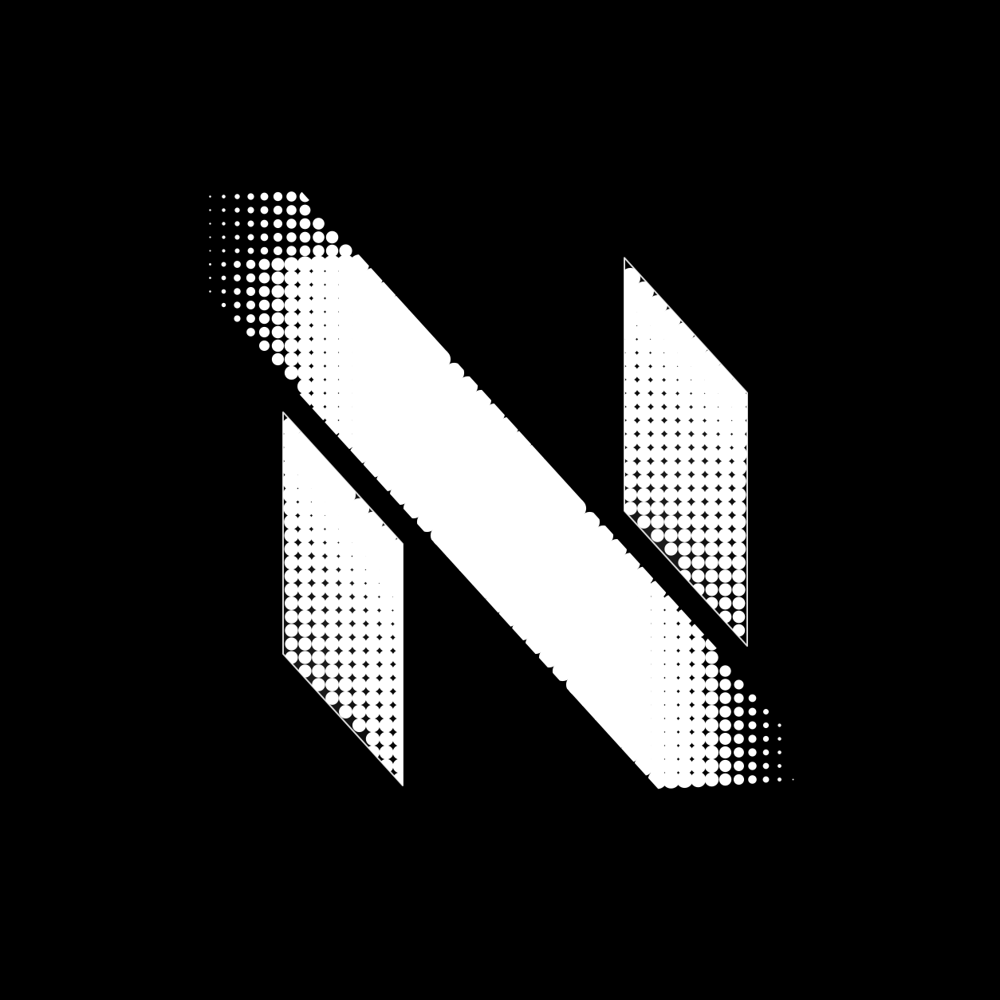
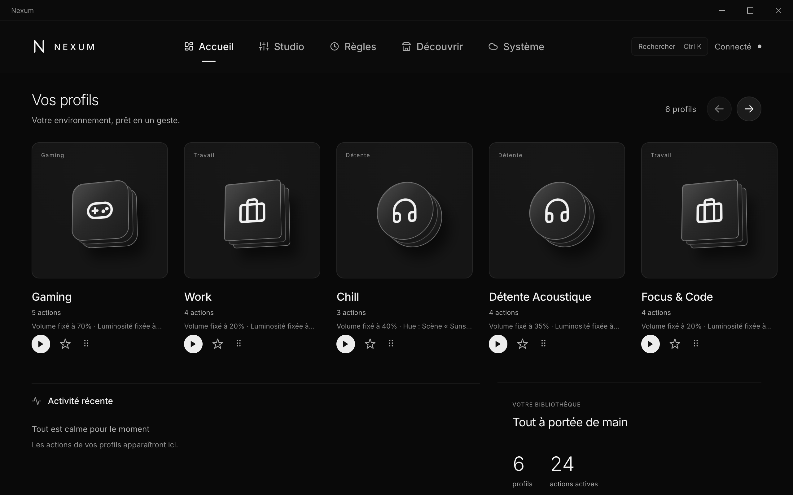
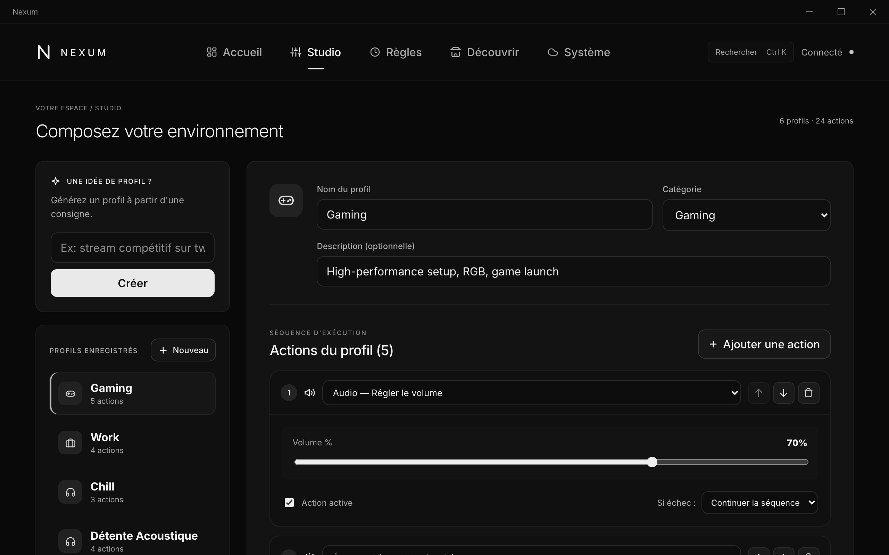
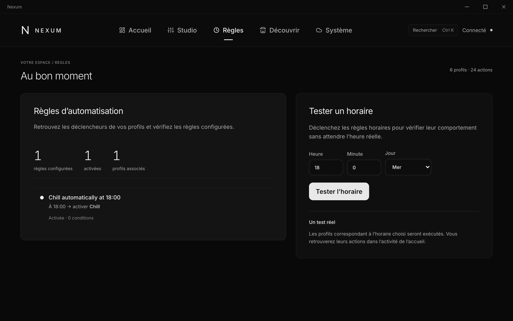
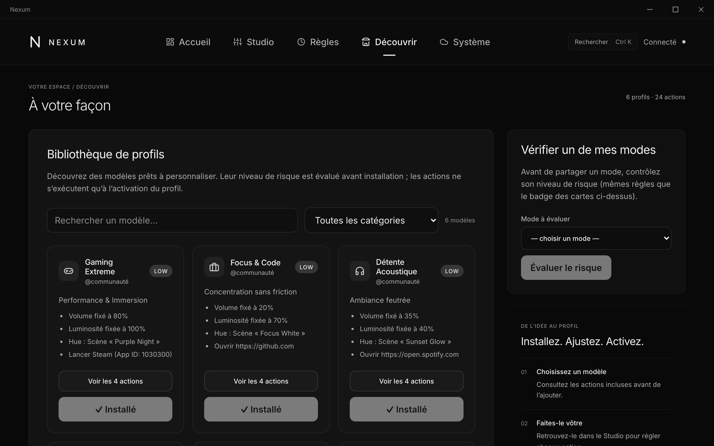

<p align="center">
  
</p>

<h1 align="center">Nexum</h1>

<p align="center">
  <strong>Your whole digital setup, one click away.</strong><br>
  A universal, no-code, brand-agnostic control center for your PC, apps, games, peripherals and smart home.
</p>

<p align="center">
  <a href="https://github.com/TeamNexum/Nexum/actions/workflows/ci.yml"></a>
  <a href="LICENSE"></a>
  
  
  
</p>

<p align="center">
  
</p>

## About

Switching from work to gaming, to a stream or to a quiet evening means juggling a
dozen things by hand: volume, screen brightness, lights, apps, launchers. Each
brand ships its own app, and none of them talk to each other.

**Nexum** replaces that with **Modes**. A mode is a list of actions (set the volume
to 70%, dim the screen, switch the Hue lights to "Purple Night", launch Steam) that
runs in one click, from a rule ("at 18:00, switch to Chill"), or
remotely from your phone. Modes are built without writing code, can be shared on a
marketplace that checks them for risky actions, and can even be generated from a
sentence ("competitive stream on Twitch").

### Context

Nexum is an **Epitech Innovative Project (EIP)**, built by a team of Epitech students
from July 2026 to July 2027. The project is evaluated on both its technical and its
entrepreneurial side, and ends with a live demo in front of the Greenlight jury.

| Phase | Period | Goal |
|---|---|---|
| **0 — Foundations** | Jul → Oct 2026 | Monorepo, Mode DSL, engine, first adapters, user interviews |
| **1 — MVP + BTP** | Oct 2026 → Jan 2027 | No-code editor, Philips Hue and Steam integrations, cloud sync, first feedback cycle |
| **2 — Iterations** | Jan → Apr 2027 | Automations, marketplace, mobile remote control, mock Greenlight |
| **3 — Finalisation** | Apr → Jul 2027 | AI Mode-as-Code demo, hardening, signed installers, Greenlight + RNCP jury |

Progress is tracked in the [milestones](https://github.com/TeamNexum/Nexum/milestones)
and [issues](https://github.com/TeamNexum/Nexum/issues); the full roadmap is in
[`docs/eip/ROADMAP_PRODUIT.md`](docs/eip/ROADMAP_PRODUIT.md).

**Team:** [@Arjouan](https://github.com/Arjouan) (project lead) ·
[@RaresFZ](https://github.com/RaresFZ) (front-end) ·
[@Max-Epinat](https://github.com/Max-Epinat) (back-end) ·
[@Raphie10](https://github.com/Raphie10) (back-end, database, CI/CD) ·
[@MAD-TEK](https://github.com/MAD-TEK)

## Screenshots

| Studio: no-code mode editor | Rules: automations |
|---|---|
|  |  |

| Discover: mode library with risk scoring |
|---|
|  |

## Features

- **Declarative Mode/Action DSL** shared across the whole app (`nexum-schema`).
- **Orchestration engine** with adapter registry, event bus, per-step `on_error`, real-time events (`nexum-core`).
- **Automation engine** — declarative WHEN/IF/THEN rules, evaluated in pure Rust (tested).
- **Marketplace safety** — static analysis + risk scoring of shared modes against an allowlist (tested).
- **AI "Mode-as-Code"** — natural language → validated Mode DSL (`nexum-core::ai`, tested; heuristic today, swaps to a Claude API call with the `claude` feature). Exposed in the cloud API and the editor's ✨ button.
- **Adapters** — real System (`launch_app`, `close_app`, `open_url`), Gaming (`launch_steam`, `launch_epic`, `launch_gog`), Windows (Core Audio COM) and Linux (`wpctl`/`pactl`) Audio, Windows and Linux Display brightness, and Philips Hue (behind the `hue` feature). RGB remains unimplemented.
- **Persistence** — `ModeStore` trait; in-memory store and persistent **SQLite store** (active by default in the desktop app via `nexum.db`).
- **Cloud** — axum REST API with JWT authentication (`register`, `login`), profile sync push/pull (`/api/modes`), remote control command queue (`/api/commands`), and Mode-as-Code generation.
- **Desktop app** — Tauri 2 + React with 5 tabs: **Accueil** (activate modes, live event feed, favorites, drag-and-drop reorder), **Studio** (no-code Mode Editor, step ordering, typed parameter forms, AI generator), **Règles** (automations + clock simulation), **Découvrir** (marketplace with static risk analysis), and **Système** (cloud sync, live connection diagnostics, UI density).
- **Mobile companion** — installable PWA (`apps/mobile`) for phone remote control over the cloud command queue.
- **CI** — GitHub Actions: fmt + clippy + tests (core), ts-rs drift check, and typecheck/vitest/playwright (frontend).
- **EIP documents** — full jury document set in [`docs/eip/`](docs/eip/README.md).

## Core idea

Everything is a typed **Action**, executed by a platform **Adapter**,
orchestrated by an event-driven **Engine**, from a declarative **Mode/Action
JSON DSL** that is shared by every component. A mode is *data, never code* — which
is what makes no-code editing, a safe Marketplace, and AI "Mode-as-Code" possible.

See the full design in **[docs/ARCHITECTURE.md](docs/ARCHITECTURE.md)**.

## Layout

```
Nexum/
├── crates/
│   ├── nexum-schema     # The Mode/Action DSL — single source of truth
│   ├── nexum-core       # Engine, Registry, Adapter trait, Event Bus (OS-agnostic, tested)
│   ├── nexum-adapters   # System / Audio / Gaming / Display / Hue integrations
│   └── nexum-store      # Persistence trait + in-memory + SQLite implementations
├── services/
│   └── nexum-cloud      # axum API (auth, sync, remote commands, AI generation)
├── apps/
│   ├── desktop          # Tauri 2 + React desktop app (its OWN cargo workspace)
│   └── mobile           # Mobile companion PWA (remote control via cloud queue)
├── packages/
│   └── schema-ts        # TypeScript mirror of the DSL generated via ts-rs
└── docs/
```

The root `Cargo.toml` is a workspace over `crates/*` + `services/*`.
`apps/desktop/src-tauri` is intentionally a **separate** workspace so Tauri's
build machinery never affects the core build/CI.

## Documentation

- **[docs/GETTING_STARTED.md](docs/GETTING_STARTED.md)** — install everything & launch the project.
- **[docs/ARCHITECTURE.md](docs/ARCHITECTURE.md)** — diagrams & rationale · **[docs/adr/](docs/adr/)** — decision records.
- **[docs/USER_GUIDE.md](docs/USER_GUIDE.md)** — end-user guide (modes, automations, marketplace, settings).
- **[docs/README.md](docs/README.md)** — full documentation index (technical · RNCP · EIP · brand).
- **[CONTRIBUTING.md](CONTRIBUTING.md)** · **[docs/GITHUB_SETUP.md](docs/GITHUB_SETUP.md)**.

## Prerequisites

- **Rust** (stable) — https://rustup.rs
- **Node.js + npm** (for the desktop frontend / Tauri CLI and mobile PWA)
- Tauri OS deps: see https://tauri.app/start/prerequisites/
  (Linux also needs `libdbus`/`pactl` for the audio adapter).

## Build & test the core (no Node needed)

```bash
cargo build            # builds all crates + the cloud service
cargo test             # runs the engine + schema + store + cloud unit tests
cargo clippy           # lint (zero warnings)
```

Run the cloud API:

```bash
cargo run -p nexum-cloud     # serves http://127.0.0.1:8787/health
```

## Run the desktop app

```bash
npm install             # from the repo root (npm workspaces)
cd apps/desktop
npm run tauri dev
```

You will see the demo modes. Activating one runs the **real** engine:
`system.open_url` and `gaming.launch_steam` / `launch_epic` / `launch_gog` fire; `audio.set_volume`
works on Windows (Core Audio) and Linux (PipeWire/PulseAudio). Brightness controls supported displays, and Hue
uses a configured bridge. RGB is not offered in the action catalog. The live action
monitor shows each step's result in real time.

## Run the mobile companion (PWA)

```bash
npm install             # from the repo root, if not done yet
cd apps/mobile
npm run dev
```

Connect your phone's browser to the displayed network URL, sign in with the same account as the desktop app, and tap modes to trigger them remotely on your PC.

## Status of adapters (V1)

| Action                                     | Status                                                  |
|--------------------------------------------|---------------------------------------------------------|
| `system.launch_app / close_app / open_url` | ✅ cross-platform                                       |
| `gaming.launch_steam`                      | ✅ via `steam://` (official, anti-cheat-safe)           |
| `gaming.launch_epic`                       | ✅ via `com.epicgames.launcher://`                     |
| `gaming.launch_gog`                        | ✅ via `goggalaxy://`                                   |
| `audio.set_volume`                         | ✅ Windows Core Audio and Linux (PipeWire / PulseAudio) |
| `display.set_brightness`                   | ✅ Windows/Linux where hardware supports it             |
| `iot.hue.activate_scene`                   | ✅ with a configured Hue bridge and scene name          |
| `peripheral.apply_rgb_profile`             | ⛔ no adapter yet (reserved for Phase 2)                |

The Windows volume adapter, generated TypeScript bindings, SQLite desktop
store, Hue scene lookup, and no-code editor are implemented and verified.
