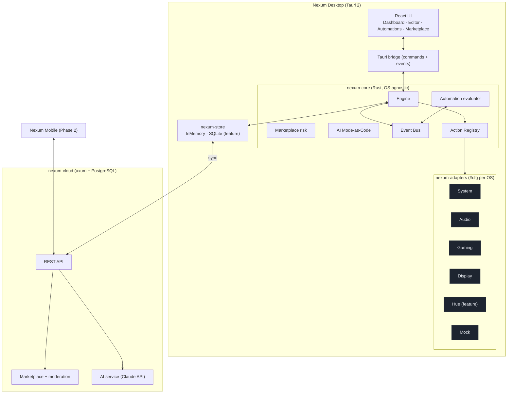
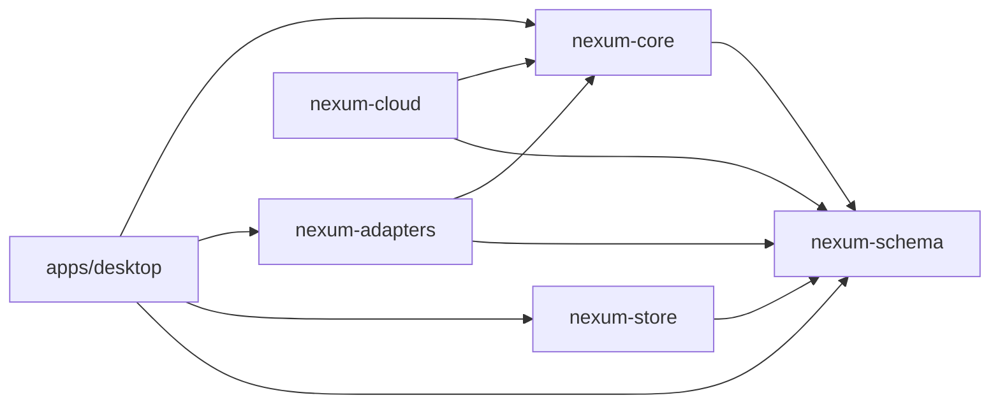
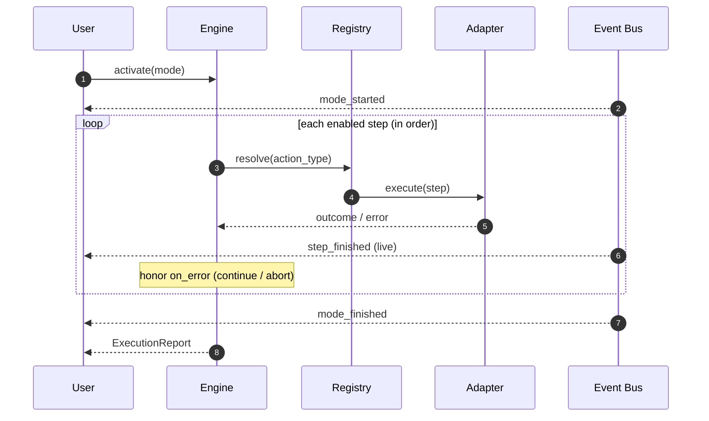

# Architecture — Nexum

Living technical overview. The full rationale is in
[`../../NEXUM_PLAN_TECHNIQUE_ET_ROADMAP.md`](../../NEXUM_PLAN_TECHNIQUE_ET_ROADMAP.md);
key decisions are recorded as [ADRs](adr/).

## Guiding idea

> Everything is a typed **Action**, executed by a platform **Adapter**,
> orchestrated by an event-driven **Engine**, from a declarative **Mode/Action
> JSON DSL** shared by every component. A mode is *data, never code*.

## Component view



## Crate dependency graph



## Mode activation (runtime)



## Data model (DSL)

```mermaid
erDiagram
    MODE ||--|{ ACTION_STEP : contains
    AUTOMATION_RULE }o--|| MODE : activates
    AUTOMATION_RULE ||--|| TRIGGER : has
    AUTOMATION_RULE ||--o{ CONDITION : guards

    MODE { uuid id; string name; string category; }
    ACTION_STEP { u32 order; string action_type; json params; bool enabled; enum on_error; }
    AUTOMATION_RULE { uuid id; string name; bool enabled; uuid target_mode_id; }
    TRIGGER { string kind; json data; }
    CONDITION { string kind; json data; }
```

## Why this shape

| Concern | How the architecture handles it |
|---|---|
| No-code | The editor manipulates the DSL; no scripting. |
| Cross-platform | Only adapters carry OS code; the mode never knows its OS. |
| Extensible | New integration = new adapter + registry entry; the engine is untouched. |
| Safe Marketplace | Shared modes are declarative data validated against an allowlist. |
| AI Mode-as-Code | The LLM emits the same DSL, then it's simulated + capability-checked. |
| Testable / QA | `nexum-core` is pure and OS-free → fast CI (RNCP Block 5). |
