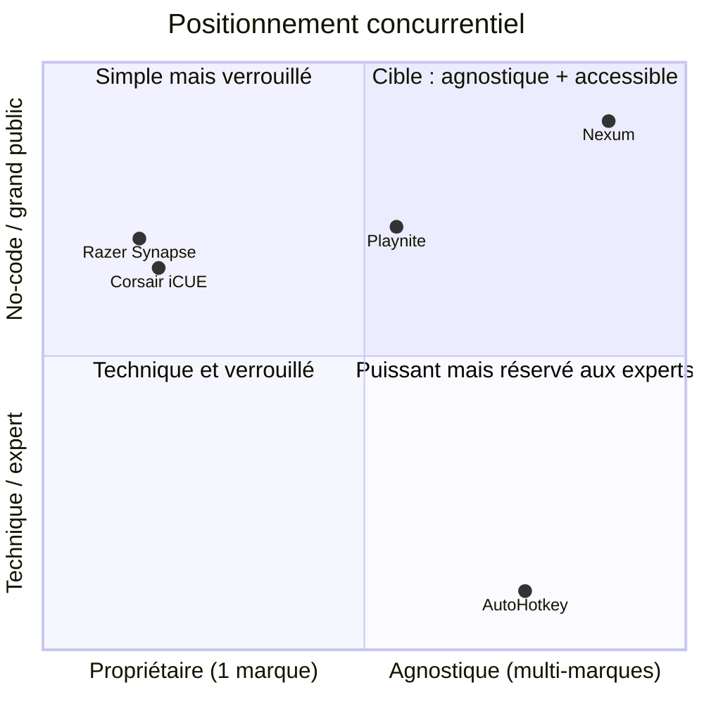
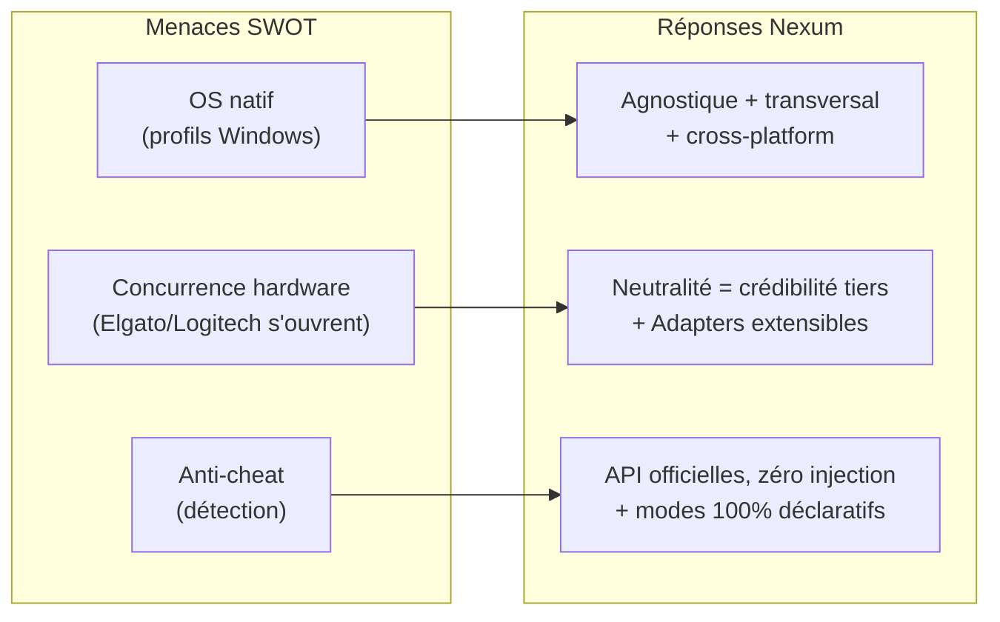

# Nexum — Analyse concurrentielle

> Document EIP (piste Entrepreneuriat). Faits et positionnement issus du
> `_BRIEF_PROJET.md` et du `NEXUM_PLAN_TECHNIQUE_ET_ROADMAP.md` (sources de vérité).
> Les éléments ajoutés sont signalés par la mention **« Hypothèse »**.
>
> Dernière mise à jour : 2026-07-13.

---

## 1. Paysage concurrentiel

Le brief identifie trois familles de concurrents, aucune ne couvrant la promesse
complète de Nexum (agnostique + no-code + orchestration universelle + IA) :

1. **Logiciels constructeurs** — Razer Synapse, Corsair iCUE : forts sur leur hardware
   maison, **verrouillés à une marque**, sans orchestration système/logiciel globale.
2. **Outils de scripting** — AutoHotkey : puissants mais **complexes**, réservés aux
   techniciens.
3. **Launchers** — Steam, Playnite : **centrés jeu**, aucune gestion IoT/système/ambiance.

---

## 2. Mapping concurrentiel détaillé

| Critère | **Nexum** | Razer Synapse | Corsair iCUE | AutoHotkey | Playnite (launcher) |
|---|---|---|---|---|---|
| **Agnostique (multi-marques)** | ✅ Oui (cœur du produit) | ❌ Razer only | ❌ Corsair only | ✅ Théorique (tout scriptable) | ⚠️ Multi-launchers mais jeu only |
| **No-code / grand public** | ✅ Oui (éditeur visuel) | ✅ GUI mais limité marque | ✅ GUI mais limité marque | ❌ Scripts uniquement | ✅ GUI (jeu) |
| **Orchestration système** (process, audio, affichage) | ✅ Oui | ⚠️ Partiel (macros) | ⚠️ Partiel | ✅ Possible (via script) | ❌ Non |
| **Orchestration logicielle** (lancer/fermer apps) | ✅ Oui | ❌ Non | ❌ Non | ✅ Possible (via script) | ⚠️ Lance des jeux |
| **IoT / smart home** (Philips Hue…) | ✅ Oui | ❌ Non | ⚠️ Éclairage Corsair only | ⚠️ Théorique (complexe) | ❌ Non |
| **Périphériques (RGB, DPI)** | ✅ Multi-marques via SDK | ✅ Razer | ✅ Corsair | ⚠️ Complexe | ❌ Non |
| **Automatisation contextuelle** (SI/ALORS, horaire, géoloc) | ✅ Oui | ❌ Non | ⚠️ Limité | ✅ Possible (script) | ❌ Non |
| **IA (langage naturel → mode)** | ✅ Mode-as-Code | ❌ Non | ❌ Non | ❌ Non | ❌ Non |
| **Marketplace de presets** | ✅ Sécurisée (JSON validé) | ⚠️ Partage limité | ⚠️ Partage limité | ⚠️ Forums de scripts | ⚠️ Extensions communautaires |
| **Cross-platform** | ✅ Windows + Linux (macOS bonus) | ⚠️ Windows/macOS | ⚠️ Windows/macOS | ❌ Windows only | ✅ Windows |
| **Performance / empreinte** | ✅ Rust/Tauri, minimale | ⚠️ Réputé lourd | ⚠️ Réputé lourd | ✅ Léger | ⚠️ Moyen |
| **Sécurité anti-cheat** | ✅ API officielles, pas d'injection | ✅ Officiel | ✅ Officiel | ❌ Risque de détection | ✅ N/A (hors-jeu) |
| **Cible** | Gamers + streamers + télétravail | Gamers Razer | Gamers Corsair | Techniciens | Gamers (bibliothèque) |

> Les appréciations « réputé lourd » sur Synapse/iCUE et « risque de détection » sur
> AutoHotkey sont des **Hypothèses** de marché courantes, cohérentes avec le SWOT du brief
> (« concurrence hardware », « risque de détection anti-cheat »).

---

## 3. Axes de différenciation

Nexum se différencie sur la **combinaison** de quatre axes qu'aucun concurrent ne réunit :

| Axe | Différenciation Nexum | Personne d'autre ne le fait car… |
|---|---|---|
| **Agnostique** | Connecte des marques concurrentes (Razer + Corsair + SteelSeries + Hue…) | Les constructeurs ont intérêt à verrouiller leur écosystème |
| **No-code** | Modes = données déclaratives (DSL JSON), éditeur visuel, zéro script | Les outils puissants (AHK) sont techniques ; les GUI simples sont limitées |
| **Orchestration universelle** | Logiciel + système + périphériques + IoT dans un seul « mode » | Chaque concurrent ne couvre qu'une couche |
| **IA Mode-as-Code** | Décrire un mode en langage naturel → JSON validé | Personne n'a de modèle de données déclaratif unifié à alimenter |

> **Fondement technique de la défendabilité** (plan technique) : « tout est une **Action**
> typée exécutée par un **Adapter**, orchestrée par un **Engine** event-driven, à partir
> d'un **DSL JSON déclaratif** partagé ». Un mode = données, jamais du code. Ce choix rend
> le no-code, le cross-platform, la Marketplace sûre et l'IA possibles **par construction**.

---

## 4. Barrières à l'entrée

| Barrière | Nature | Qui protège-t-elle ? |
|---|---|---|
| **Volume d'intégrations** (connecteurs API : Steam, Hue, SDK périphériques…) | Effort de développement cumulatif ; architecture par Adapters = ajout incrémental | Protège Nexum une fois la base large ; ralentit un nouvel entrant |
| **Architecture DSL / no-code sûr** | Modèle de données déclaratif unifié, difficile à répliquer proprement | Avantage technique de Nexum |
| **Marketplace + effet réseau** | Bibliothèque de presets communautaires + réputation créateurs | Effet réseau : plus il y a de presets, plus l'app a de valeur *(barrière future)* |
| **Effet Marketplace / viralité** | Partage de presets via influenceurs | Cité comme opportunité dans le SWOT |
| **Conformité anti-cheat & sécurité** | Usage d'API officielles, pas d'injection, RGPD | Barrière de confiance difficile à rattraper pour un outil « script » |
| **Relations constructeurs / SDK** | Accès aux SDK (Logitech, Corsair, SteelSeries, Hue) | *(Hypothèse)* accès et partenariats officiels = crédibilité |

> **Faiblesse à noter (brief)** : Nexum est au stade POC, avec un gros besoin de dev et
> une dépendance aux API tierces — les barrières ci-dessus se construisent, elles ne sont
> pas encore acquises.

---

## 5. Positionnement (mapping 2 axes)

Axe horizontal : **Agnostique ↔ Propriétaire (verrouillé à une marque)**.
Axe vertical : **No-code / grand public ↔ Technique / expert**.

**Lecture :** le quadrant « agnostique **et** grand public / no-code » (haut-droite) est
**vide** hors Nexum. Razer et Corsair sont simples mais verrouillés (haut-gauche) ;
AutoHotkey est agnostique mais réservé aux experts (bas-droite) ; les launchers type
Playnite sont accessibles mais centrés jeu. Nexum occupe l'espace non couvert.

> Coordonnées indicatives *(Hypothèse)* posées pour illustrer le positionnement relatif ;
> les rangs (qui est plus agnostique / plus no-code que qui) découlent du brief.

---

## 6. Réponse aux menaces du SWOT

Le brief identifie trois menaces principales. Réponses argumentées pour le jury :

| Menace (SWOT) | Analyse | Réponse / mitigation Nexum |
|---|---|---|
| **OS natif** — Windows intègre des profils nativement | Les OS peuvent proposer des profils basiques, mais restent **liés à leur écosystème** et sans orchestration multi-marques ni IoT | Nexum reste **agnostique et transversal** (logiciel + système + périphériques concurrents + IoT + IA). Positionnement au-dessus de l'OS, pas en concurrence frontale. Cross-platform (Windows **et** Linux) là où un profil OS est mono-système. |
| **Concurrence hardware** — Elgato/Logitech ouvrent leurs logiciels | Un constructeur qui s'ouvre reste **structurellement incité à favoriser sa marque** | La neutralité de Nexum est un **atout défendable** : un tiers indépendant est plus crédible pour orchestrer des marques concurrentes. Architecture par Adapters = intégrer un nouveau constructeur rapidement. |
| **Anti-cheat** — Nexum vu comme de la triche | Risque de détection si Nexum touchait aux jeux | **Ne jamais injecter dans les jeux** ; n'utiliser que des **API officielles** (SDK, `steam://`). Les modes ne contiennent **aucun code exécutable** (JSON déclaratif d'actions d'une allowlist) → surface de risque minimale. À documenter explicitement pour rassurer le jury. |

---

## 7. Synthèse

Nexum n'attaque aucun concurrent frontalement sur son terrain : il occupe un **espace
vide** (agnostique **et** no-code **et** orchestration universelle **et** IA) qu'aucun
acteur ne couvre aujourd'hui. Les concurrents établis sont soit **verrouillés à une
marque** (Razer, Corsair), soit **réservés aux experts** (AutoHotkey), soit **centrés
jeu** (launchers). Les barrières à l'entrée de Nexum (volume d'intégrations, DSL sûr,
effet réseau Marketplace, conformité anti-cheat) se construisent progressivement, et les
menaces du SWOT trouvent des réponses cohérentes avec l'architecture technique
(neutralité, API officielles, modes déclaratifs sans code).
