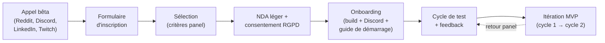

# Nexum — Recrutement bêta-testeurs & partenariats

> Document EIP (piste Entrepreneuriat). Aligné avec [`_BRIEF_PROJET.md`](./_BRIEF_PROJET.md)
> (produit, personas, dates, périmètre) et [`ETUDE_DE_MARCHE.md`](./ETUDE_DE_MARCHE.md)
> (canaux, objectifs de traction, funnel). Ton & visuels : voir
> [`../brand/BRAND_GUIDELINES.md`](../brand/BRAND_GUIDELINES.md).
>
> Les éléments non issus du brief sont signalés **« Hypothèse »**.
> Dernière mise à jour : 2026-07-13.

---

## 1. Objectif

**Recruter et animer un minimum de 20 bêta-testeurs actifs**, cible fixée par les objectifs
de traction (étude de marché §9) et à démontrer autour du **rendu Beta Test Plan (BTP) de
janvier 2027**.

- **« Actif »** = a installé Nexum, activé au moins **3 modes réels**, et renvoyé au moins
  **1 feedback structuré** sur un cycle de test. *(Hypothèse — définition de travail.)*
- **Objectif de recrutement brut :** viser **~40 inscrits** pour obtenir **20 actifs**
  (taux d'attrition ~50 % attendu sur un panel bêta). *(Hypothèse.)*
- **Contribution à l'EIP :** les 20 bêta-testeurs alimentent les **2 cycles d'itération MVP
  minimum** exigés et complètent les **15-20 interviews utilisateurs** de validation marché.

---

## 2. Profil cible

On recherche un panel équilibré sur les **3 personas** du brief, avec une majorité de
profils techniquement à l'aise (early adopters) capables de remonter un feedback utile.

| Persona | Part visée du panel *(Hypothèse)* | Ce qu'on teste avec lui |
|---|---|---|
| **Léo — Gamer compétitif** (22 ans) | ~50 % (10+) | Modes performance, coupe de process, RGB, lancement jeux, compat anti-cheat |
| **Maxime — Streamer** (28 ans) | ~25 % (5+) | Mode « Direct », orchestration OBS/Spotify/lumières, scènes |
| **Sarah — Dév en télétravail** (34 ans) | ~25 % (5+) | Mode « Chill », automatisation horaire, séparation pro/perso |

**Critères matériels (pour couvrir le périmètre V1) :**
- OS : **Windows en priorité**, quelques **Linux** (le périmètre V1 cible les deux).
- Bonus recherché : possède du matériel intégrable en V1 — **Philips Hue**, **SteelSeries**,
  **Logitech** ou **Corsair** (via SDK), multi-marques (>3).
- Profil idéal : setup multi-périphériques, plusieurs marques concurrentes (le cœur de
  cible « agnostique »).

---

## 3. Canaux de recrutement

| Canal | Détail | Persona visé | Coût |
|---|---|---|---|
| **Reddit** | r/battlestations, r/pcgaming, r/pcmasterrace, r/Twitch, r/linux_gaming | Léo, Maxime | Organique |
| **Discord gaming** | Serveur Nexum + serveurs communautaires (setups, RGB, streaming), avec accord des modérateurs | Léo, Maxime | Organique |
| **Écoles / Epitech** | Réseau Epitech, promos, associations gaming étudiantes | Léo, Sarah | Organique |
| **Twitch** | Micro-streamers de niche (relais d'appel bêta, démo live) | Maxime, Léo | Faible cachet |
| **LinkedIn** | Appel bêta « pro/télétravail » + réseau EIP | Sarah, devs | Organique |
| **Instagram** | Renvoi vers le formulaire via Reels/Stories (cf. calendrier éditorial) | Léo, Maxime | Organique |
| **Bouche-à-oreille / interviews** | Convertir les personnes interviewées (validation marché) en bêta-testeurs | Tous | Nul |

> **Hypothèse** : toujours respecter les règles de chaque communauté (pas de spam ;
> demander l'autorisation aux modérateurs Reddit/Discord ; privilégier des posts
> authentiques « build in public » plutôt que de la pub déguisée).

---

## 4. Processus de recrutement & d'onboarding



### 4.1 Formulaire d'inscription

Champs recommandés (*Hypothèse*, outil : Google Forms / Tally) :
- Prénom + contact (email ; pseudo Discord).
- OS et version (Windows / Linux).
- Matériel possédé (marques de périphériques ; objets connectés : Hue, etc.).
- Usage principal (gaming compétitif / streaming / télétravail / mixte) → mapping persona.
- Niveau technique auto-évalué (1-5).
- Disponibilité pour tester (~30 min/semaine ?) et pour un appel feedback (oui/non).
- Consentement RGPD (traitement des données de test) + acceptation du principe de NDA léger.

### 4.2 Critères de sélection

- Couvrir les **3 personas** selon la répartition cible (§2).
- Prioriser les setups **multi-marques** (cœur de cible agnostique).
- Assurer un **mix Windows / Linux** représentatif du périmètre V1.
- Écarter les doublons de profil au-delà du quota, les mettre en **liste d'attente**.
- Engagement déclaré à tester régulièrement (disponibilité ≥ 30 min/semaine).

### 4.3 NDA léger

- **Objet :** confidentialité des fonctionnalités non publiées et des bugs remontés ;
  autorisation d'utiliser des retours anonymisés (citations, verbatims) pour l'EIP et la
  communication.
- **Esprit :** léger et lisible (1 page), non intimidant — on est un projet étudiant, pas
  une multinationale. *(Hypothèse : à faire relire ; ne constitue pas un avis juridique.)*
- **RGPD :** données minimales, finalité limitée (test + amélioration), droit de retrait,
  suppression en fin de bêta.

### 4.4 Onboarding

- Invitation au **serveur Discord** (canal `#beta`), rôle « Bêta-testeur ».
- Lien de téléchargement du **build signé** + guide de démarrage rapide (installer,
  créer 3 modes types Ranked/Direct/Chill).
- **Kit de bienvenue** : présentation du protocole de test, du calendrier des cycles, des
  incentives, et du canal de remontée de feedback.
- Objectif : atteindre le **« aha moment »** (1er mode réel activé) en < 10 minutes.

### 4.5 Incentives *(Hypothèse — budget contraint, cf. étude de marché §8)*

- **Licence Lifetime offerte** (valeur ~49 €) aux bêta-testeurs actifs jusqu'au bout.
- **Badge « Founding Beta »** exclusif (profil Discord + éventuel badge in-app).
- Nom au **générique / crédits** de l'app et remerciement public (avec accord).
- **Accès prioritaire** aux nouvelles fonctionnalités et à la Marketplace.
- Petits **goodies / concours** communautaires (stickers, tirage au sort).

---

## 5. Protocole de test & boucle de feedback

| Élément | Modalité *(Hypothèse)* |
|---|---|
| **Durée** | 2 cycles de ~3-4 semaines (aligné sur les 2 cycles d'itération MVP EIP) |
| **Tâches guidées** | Scénarios par persona (créer un Mode Ranked / Direct / Chill, activer, mesurer l'effet) |
| **Usage libre** | Utilisation réelle au quotidien pendant chaque cycle |
| **Remontée continue** | Canal Discord `#feedback` + bouton « signaler un bug » in-app *(Hypothèse)* |
| **Remontée structurée** | Court questionnaire de fin de cycle (SUS + satisfaction + verbatims) |
| **Entretiens** | 3-5 appels de 20 min par cycle (échantillon des 3 personas) |

**Boucle :** collecte → tri & priorisation (impact × fréquence) → correction/itération →
release du cycle suivant → re-test. Communiquer publiquement les changements (changelog
Discord) pour entretenir l'engagement.

**KPIs bêta** *(Hypothèse)* :

| Indicateur | Cible |
|---|---|
| Bêta-testeurs **actifs** | **≥ 20** |
| Rétention sur les 2 cycles | ≥ 60 % des sélectionnés |
| Bugs critiques résolus avant BTP | 100 % |
| Score de satisfaction (SUS) | ≥ 70/100 |
| Activation (1er mode réel activé) | ≥ 90 % des onboardés |

---

## 6. Partenaires potentiels

> **Hypothèse** : cibles d'approche à des fins d'intégration produit, de co-visibilité ou
> de test matériel. Le périmètre V1 (Philips Hue, SteelSeries, Logitech, Corsair via SDK)
> guide la priorité. Approche « projet étudiant EIP » : on vise d'abord des **programmes
> développeurs / SDK** et de la **co-visibilité**, pas des contrats commerciaux lourds.

| Partenaire | Lien avec le produit | Intérêt mutuel | Angle d'approche | Priorité |
|---|---|---|---|---|
| **Philips Hue** (Signify) | Scènes lumières = effet waouh V1 | Nexum met en scène leurs produits ; eux offrent un cas d'usage cross-marque | Accès API/SDK Hue (déjà public), demande de mise en avant « works with » | **Haute** |
| **SteelSeries** | RGB intégré en V1 (GameSense SDK) | Valorise leur SDK ouvert ; démo agnostique | Programme dev SteelSeries GameSense, contact relations dév | **Haute** |
| **Logitech** (G) | Périphériques via SDK | Étend l'utilité de leur écosystème G HUB | Programme partenaires / SDK Logitech G | **Haute** |
| **Corsair** (iCUE) | Périphériques via SDK | Idem — Nexum comble le manque d'orchestration système/logiciel | Accès iCUE SDK, contact relations dév | **Haute** |
| **Elgato** | Stream Deck, éclairage Key Light (streaming) | Cœur du persona Maxime ; complète le mode « Direct » | SDK Stream Deck / plugin, co-démo streaming | **Moyenne** |
| **Nanoleaf** | Panneaux lumineux (ambiance, Matter) | Standardisation IoT (Matter) = axe SWOT ; visuel fort | API Nanoleaf + angle Matter | **Moyenne** |
| **Salles e-sport / LAN** | Déploiement multi-postes | Config instantanée de postes par mode ; piste B2B (licences volume) | Pilote local (Marseille/Paris), offre B2B | **Moyenne** |
| **Twitch (micro-streamers)** | Relais & démo live | Contenu pour eux, visibilité pour Nexum | Partenariat contenu (cf. calendrier éditorial) | **Moyenne** |

**Note stratégique (SWOT) :** cultiver ces partenariats atténue la menace « concurrence
hardware » (Elgato/Logitech ouvrent leurs logiciels) en positionnant Nexum comme la couche
**neutre et complémentaire** au-dessus de leurs écosystèmes, plutôt qu'un concurrent.

---

## 7. Templates

### 7.1 Template — email d'approche partenaire

> À personnaliser par destinataire (remplacer les champs `[…]`). Vouvoiement, ton pro
> (cf. `BRAND_GUIDELINES.md`). Version FR ; prévoir une version EN pour les partenaires
> internationaux.

```
Objet : Nexum × [Partenaire] — orchestration multi-marques, votre matériel mis en scène

Bonjour [Prénom / équipe Relations Développeurs],

Je m'appelle [Nom], du projet Nexum (projet de fin d'études Epitech, promo 2028).
Nexum est une application desktop no-code et agnostique qui synchronise en un clic tout
l'environnement d'un utilisateur — logiciels, système, périphériques et objets connectés —
selon son activité, via des « modes » (jeu, stream, télétravail).

Concrètement, un utilisateur active un mode et Nexum orchestre l'ensemble de son setup.
Le matériel [Partenaire] y tient un rôle central : [ex. : les scènes lumières Hue / le RGB
GameSense / les périphériques G] déclenchés automatiquement, aux côtés d'autres marques.

Ce qui nous intéresse :
- Accéder à votre SDK / programme développeurs pour une intégration propre et pérenne ;
- Vous mettre en avant comme intégration officielle (« works with [Partenaire] ») ;
- Envisager une co-visibilité (démo, contenu) lors de notre bêta (janvier 2027) et de
  notre lancement (2027).

L'intérêt pour vous : Nexum valorise votre écosystème auprès d'utilisateurs multi-marques
et démontre la richesse de votre SDK, sans se substituer à votre logiciel.

Seriez-vous disponible pour un échange de 20 minutes ? Je peux vous envoyer une courte
démo et notre one-pager.

Merci pour votre temps,
[Nom] — Nexum (EIP Epitech)
[email] · [lien one-pager / démo]
```

### 7.2 Template — message de recrutement bêta

> Ton complice, tutoiement (cf. `BRAND_GUIDELINES.md`). À adapter au canal (Reddit /
> Discord / LinkedIn — sur LinkedIn, passer au vouvoiement). Respecter les règles de la
> communauté et l'autorisation des modérateurs.

```
🎮 On cherche 20 bêta-testeurs pour Nexum — jouer, streamer ou chiller sans friction.

Ton setup, c'est 3 launchers, 2 logiciels de marque et une app pour tes lumières ?
Nous aussi, et on en a eu marre. Alors on construit Nexum : une app no-code et agnostique
qui synchronise TOUT ton environnement (logiciels, système, périphériques, objets
connectés) en un clic, selon ton activité — un « Mode Ranked », un « Mode Direct », un
« Mode Chill »…

On recherche :
- des joueurs, streamers ou télétravailleurs sur Windows (ou Linux) ;
- idéalement du matériel multi-marques (Philips Hue, SteelSeries, Logitech, Corsair…) ;
- ~30 min/semaine pour tester et nous dire ce qui va / ce qui ne va pas.

Ce que tu y gagnes :
- la licence Lifetime offerte (≈ 49 €) si tu vas au bout de la bêta ;
- un badge « Founding Beta » + ton nom dans les crédits ;
- un accès prioritaire aux nouveautés et à la Marketplace de presets.

👉 Inscription (2 min) : [lien formulaire]
Des questions ? Rejoins le Discord : [lien]

(Projet de fin d'études Epitech — on construit en public, tes retours façonnent le produit.)
```
