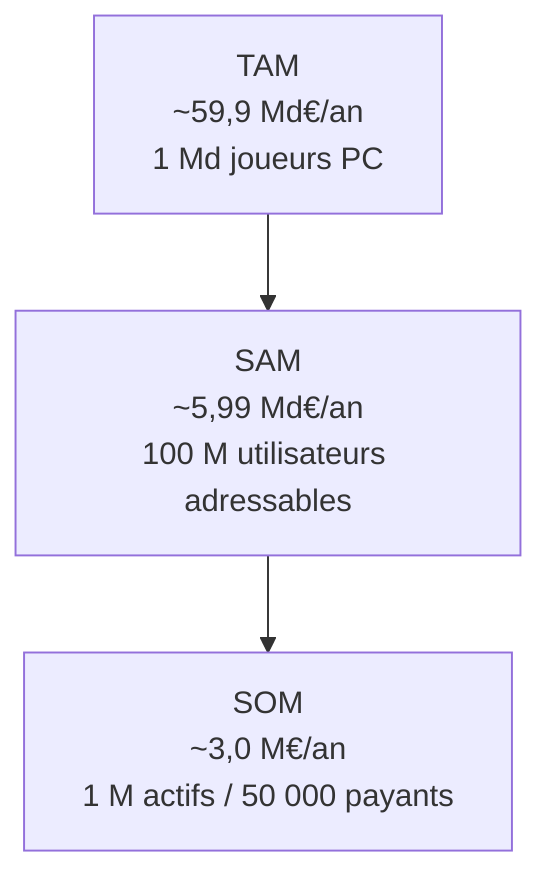
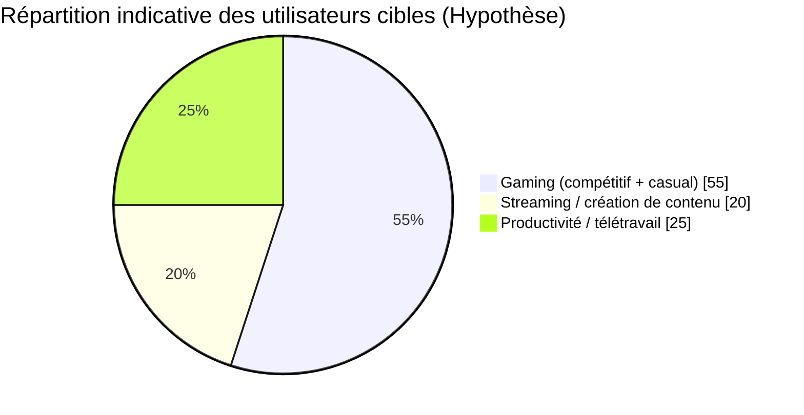
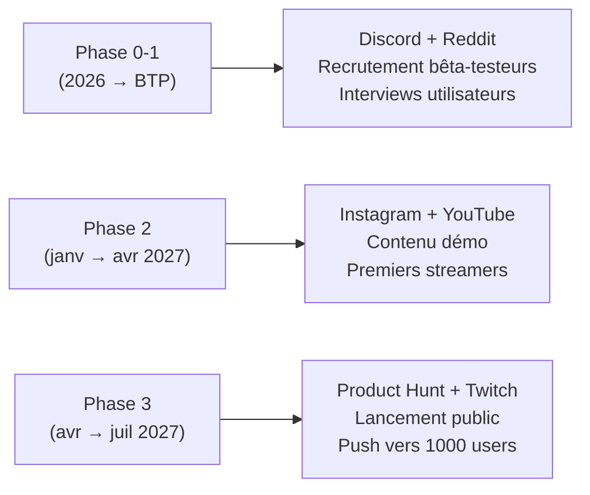
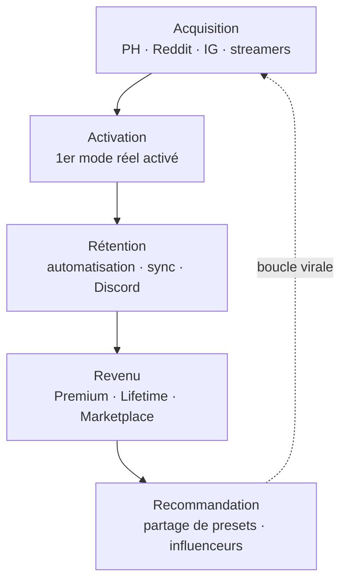
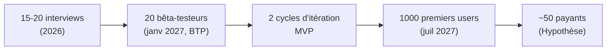

# Nexum — Étude de marché & plan marketing

> Document EIP (piste Entrepreneuriat). Toutes les données chiffrées proviennent du
> `_BRIEF_PROJET.md` (source de vérité). Les éléments non issus du brief sont
> explicitement signalés par la mention **« Hypothèse »**.
>
> Dernière mise à jour : 2026-07-13.

---

## 1. Rappel du positionnement produit

Nexum est une **application universelle, no-code et agnostique** qui synchronise en un
clic tout l'environnement numérique (logiciels, système, périphériques, objets
connectés) selon l'activité, via des « modes ».

> Tagline : « Nexum : jouer, streamer ou chiller sans friction. »

Les 5 axes de valeur (radar) : Interopérabilité (5/5), No-code (5/5), Performance
système (4/5), Personnalisation IA (4/5), Stabilité & sécurité (4/5).

---

## 2. Taille et segmentation du marché

### 2.1 Données de cadrage (issues du brief)

| Indicateur | Valeur | Source (citée dans le brief) |
|---|---|---|
| Marché mondial du gaming | **197 Md$ (2025)** | Newzoo |
| Segment PC (gaming) | **43 Md$**, croissance **+10,4 %** | Newzoo |
| Joueurs dans le monde | **3,32 Md** dont **~1 Md sur PC** (franchit le milliard en 2026) | DemandSage |
| Croissance software gaming (TCAC) | **+10,37 % à +12,68 %/an** | Mordor Intelligence |
| Segment abonnement (le plus rapide) | TCAC **~19,5 %** | Mordor Intelligence |
| Smart home / IoT | **147,5 Md$ (2025) → 848 Md$ (2034)** | Fortune Business Insights |
| Joueurs PC utilisant ≥ 3 marques de périphériques | **> 50 %** | Brief |
| Potentiel d'utilisateurs PC | **~1 milliard** | Brief |

### 2.2 Calcul TAM / SAM / SOM

Nexum monétise via un **abonnement Premium SaaS à ~4,99 €/mois** (soit **~59,88 €/an**)
et une **licence Lifetime à ~49 €**. Le calcul ci-dessous raisonne en **revenu annuel
potentiel** sur la base du parc d'utilisateurs PC et du prix Premium annuel, ce qui donne
un marché adressable exprimé en valeur.

> **Hypothèses de calcul explicitement posées :**
> - **H1** — Population de base = **1 milliard de joueurs PC** (chiffre du brief).
> - **H2** — Prix de référence retenu pour la valorisation = **59,88 €/an** (Premium 4,99 €/mois). Choix conservateur : on ne mélange pas la licence Lifetime.
> - **H3 (SAM)** — Cible réaliste = **joueurs PC multi-périphériques** = **> 50 %** du parc (chiffre du brief) → on retient **50 %**, soit **500 M** d'utilisateurs pertinents pour une solution agnostique.
> - **H4 (SAM)** — Taux d'adressabilité effectif (accès marché, langue, plateforme supportée Windows/Linux, sensibilité au sujet) = **20 %** du segment multi-périphériques. *(Hypothèse.)*
> - **H5 (SOM)** — Part de marché captable à un horizon 3-5 ans par un nouvel entrant EIP = **1 %** du SAM en nombre d'utilisateurs, avec un **taux de conversion payant de 5 %** (freemium). *(Hypothèse.)*

| Niveau | Définition | Base d'utilisateurs | Base payante | Calcul (valeur annuelle) | Résultat |
|---|---|---|---|---|---|
| **TAM** (Total Addressable Market) | Tous les joueurs PC mondiaux, s'ils payaient le Premium annuel | 1 000 M | 1 000 M | 1 000 M × 59,88 € | **≈ 59,9 Md€/an** |
| **SAM** (Serviceable Available Market) | Joueurs PC multi-périphériques adressables (H3 × H4) | 500 M × 20 % = **100 M** | 100 M | 100 M × 59,88 € | **≈ 5,99 Md€/an** |
| **SOM** (Serviceable Obtainable Market) | Part captable par Nexum à 3-5 ans (H5) | 1 % × 100 M = **1 M** utilisateurs actifs | 5 % × 1 M = **50 000** payants | 50 000 × 59,88 € | **≈ 3,0 M€/an** |

**Lecture pour le jury :** même avec des hypothèses volontairement prudentes (50 % du
segment, 20 % d'adressabilité, 1 % de capture, 5 % de conversion), le SOM à moyen terme
atteint **~3 M€ de revenu annuel récurrent**, sur un TAM de près de **60 Md€**. Le marché
est donc largement assez grand pour justifier le projet, et la contrainte n'est pas la
taille du marché mais l'**exécution** (acquisition + conversion).

> **Note de cohérence :** le TAM « valeur » (59,9 Md€) est du même ordre de grandeur que
> le chiffre d'affaires mondial du gaming (197 Md$) et bien supérieur au seul segment
> software PC — ce qui est logique puisque Nexum adresse aussi la couche IoT/smart home
> (147,5 Md$ en 2025), en forte croissance.

### 2.3 Segmentation

> **Hypothèse** : répartition 55 / 20 / 25 posée pour la planification marketing ; à
> réviser après les 15-20 interviews utilisateurs (Phase 0).

---

## 3. Tendances de marché

| Tendance | Impact pour Nexum | Source / rattachement |
|---|---|---|
| PC gaming en croissance à deux chiffres (+10,4 %) | Marché porteur, base d'utilisateurs qui grandit | Newzoo (brief) |
| Le milliard de joueurs PC franchi en 2026 | Fenêtre de lancement favorable (timing EIP) | DemandSage (brief) |
| Modèles par **abonnement** = segment le plus rapide (TCAC ~19,5 %) | Valide le choix du **Premium SaaS** de Nexum | Mordor Intelligence (brief) |
| Explosion du **smart home / IoT** (×5,7 d'ici 2034) | Renforce l'axe orchestration IoT (Philips Hue…) | Fortune Business Insights (brief) |
| **Fragmentation matérielle** : > 50 % des joueurs ont ≥ 3 marques | Cœur du besoin « agnostique » — différenciateur n°1 | Brief |
| Standardisation IoT (**Matter**) | Facilite l'ajout d'intégrations, réduit le coût des connecteurs | SWOT (brief) |
| Boom du **télétravail** (séparation pro/perso) | Ouvre le segment productivité (persona Sarah) | SWOT (brief) |
| Croissance de l'**e-sport** | Alimente le segment gaming compétitif (persona Léo) | SWOT (brief) |

---

## 4. Segments cibles & personas

### 4.1 Les trois segments

| Segment | Besoin principal | Déclencheur d'achat | Fonctionnalités clés Nexum |
|---|---|---|---|
| **Gaming** | Performance max, zéro friction avant une session | Perte de temps + reflets/distractions | Couper les process inutiles, régler lumières/RGB, lancer le jeu (Steam/Epic/GOG) |
| **Streaming** | Lancer tout le setup « Direct » en un clic | Complexité OBS + Spotify + lumières + retour caméra | Orchestration multi-logiciels, scènes lumières, un mode « Direct » |
| **Productivité / télétravail** | Séparation nette pro/perso, ambiance adaptée | Même PC pour travail et détente | Automatisation horaire (« Mode Chill » après 18h), couper Slack, tamiser les lumières |

### 4.2 Personas (issus du brief)

| Persona | Profil | Douleur | Ce que Nexum lui apporte |
|---|---|---|---|
| **Léo Bernard, 22 ans** | Gamer compétitif (Valorant, LoL) | Temps de préparation, reflets d'écran | Un mode « Ranked » qui coupe le superflu, règle lumières et volume, lance le jeu |
| **Maxime Roux, 28 ans** | Streamer Twitch | Jongler entre OBS, Spotify, scènes, retour caméra | Un mode « Direct » qui lance tout le setup en un clic |
| **Sarah Martin, 34 ans** | Développeuse en télétravail | Même PC pro/perso, pas de coupure nette | « Mode Chill » automatique après 18h (lumières tamisées, Slack coupé, Spotify lancé) |

---

## 5. Canaux d'acquisition

### 5.1 Cartographie des canaux

| Canal | Segment visé prioritairement | Rôle dans le funnel | Format | Coût |
|---|---|---|---|---|
| **Instagram (showcase)** | Gaming, streaming | Awareness / désir | Reels courts « avant/après », setups RGB, before/after en un clic | Faible (organique) |
| **LinkedIn** | Productivité / télétravail + B2B | Awareness / crédibilité | Posts fondateurs, cas d'usage pro/perso, coulisses EIP | Faible (organique) |
| **Twitch / YouTube** | Gaming, streaming | Awareness / activation | Partenariats streamers, démos live, intégrations sponsorisées | Moyen à élevé |
| **Product Hunt** | Early adopters / tech | Acquisition (pic de lancement) | Lancement « launch day » avec assets, GIF de démo | Faible |
| **Reddit** (r/pcgaming, r/battlestations, r/Twitch…) | Gaming, streaming | Acquisition / communauté | Posts de démo authentiques, AMA, réponses utiles | Faible (organique) |
| **Discord** (serveur Nexum + serveurs partenaires) | Tous | Activation / rétention / rétention communautaire | Support, partage de presets, feedback, bêta | Faible |

### 5.2 Priorisation par phase (aligné roadmap EIP)

---

## 6. Funnel AARRR

| Étape | Objectif | Leviers Nexum | KPI indicatif (Hypothèse) |
|---|---|---|---|
| **Acquisition** | Faire venir l'utilisateur | Product Hunt, Reddit, Instagram, streamers | Visiteurs site, installs |
| **Activation** | Premier « aha moment » = 1 mode activé qui agit vraiment | Onboarding, 3 modes gratuits, effet « waouh » Philips Hue | % installs → 1er mode activé ≥ **40 %** |
| **Rétention** | Usage récurrent | Automatisation (Mode Chill), sync cloud multi-machines, Discord | Rétention J30 ≥ **25 %** |
| **Revenu** | Passage au payant | Premium 4,99 €/mois, Lifetime 49 €, Marketplace | Conversion free→payant ≥ **5 %** |
| **Recommandation** | Viralité | Partage de presets (Marketplace), effet influenceurs | Coefficient viral k ≥ **0,3** |

> **Hypothèse** : tous les seuils de KPI ci-dessus sont des cibles de travail, à
> calibrer après les 2 cycles d'itération MVP exigés par l'EIP.

---

## 7. Plan de contenu

| Pilier de contenu | Canaux | Fréquence (Hypothèse) | Objectif funnel |
|---|---|---|---|
| **« Un clic, tout change »** (démos avant/après) | Instagram, YouTube Shorts, Reddit | 2-3 / semaine | Acquisition / Activation |
| **Effet visuel IoT** (Philips Hue, RGB synchronisés) | Instagram, Twitch | 1 / semaine | Acquisition |
| **Cas d'usage par persona** (Ranked / Direct / Chill) | LinkedIn, YouTube | 1 / semaine | Activation |
| **Coulisses EIP & build in public** | LinkedIn, Discord | 1 / semaine | Crédibilité / communauté |
| **Tutoriels no-code & partage de presets** | YouTube, Discord | 1 / 2 semaines | Rétention / Recommandation |
| **Mises à jour produit / changelog** | Discord, Reddit | À chaque release | Rétention |

---

## 8. Budget marketing indicatif

> **Hypothèse** : projet étudiant EIP à budget contraint. Le budget ci-dessous est une
> enveloppe **indicative** couvrant la période de lancement (Phase 2 → Phase 3, ~6 mois).
> La stratégie repose d'abord sur l'**organique** (coût quasi nul), les dépenses payantes
> servant uniquement à amplifier autour du lancement Product Hunt et de la démo Greenlight.

| Poste | Détail | Budget indicatif (Hypothèse) |
|---|---|---|
| Partenariats micro-streamers Twitch/YouTube | 3-5 créateurs de niche, contre-partie + petit cachet | 1 500 € |
| Publicité ciblée (Instagram / Reddit) | Amplification autour du lancement | 800 € |
| Assets de lancement (Product Hunt, visuels, montage) | Freelance ponctuel / outils | 500 € |
| Outils (emailing, analytics, design) | Abonnements légers | 400 € |
| Goodies / concours communautaires (Discord) | Fidélisation early adopters | 300 € |
| **Total (~6 mois)** | | **~3 500 €** |

---

## 9. Objectifs de traction

| Jalon | Cible | Échéance (alignée roadmap EIP) |
|---|---|---|
| Interviews utilisateurs (validation marché) | **15-20** interviews | Phase 0 (2026) — *objectif EIP obligatoire* |
| **Bêta-testeurs** | **20** bêta-testeurs actifs | Autour du BTP (janvier 2027) |
| Cycles d'itération MVP | **2 cycles minimum** | Phase 1 → Phase 2 — *objectif EIP obligatoire* |
| Utilisateurs au lancement public | **Premiers 1000 users** | Phase 3 (avr → juil 2027) |
| Utilisateurs payants (conversion 5 %) | **~50 payants** sur 1000 | Post-Greenlight *(Hypothèse)* |

**Synthèse :** les objectifs de traction sont volontairement calibrés sur le calendrier
EIP (BTP janvier 2027, Greenlight juillet 2027) et sur les exigences obligatoires de la
piste Entrepreneuriat (15-20 interviews, 2 cycles d'itération). Le seuil des « 1000
premiers users » constitue une preuve de traction crédible et démontrable devant le jury,
sans nécessiter un budget d'acquisition significatif grâce à la stratégie majoritairement
organique.
