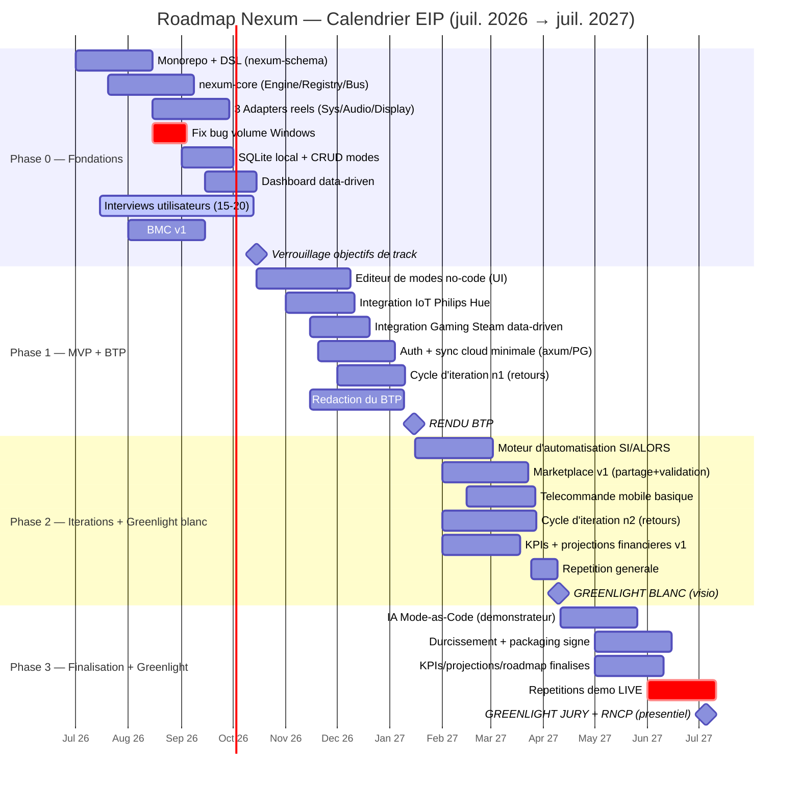
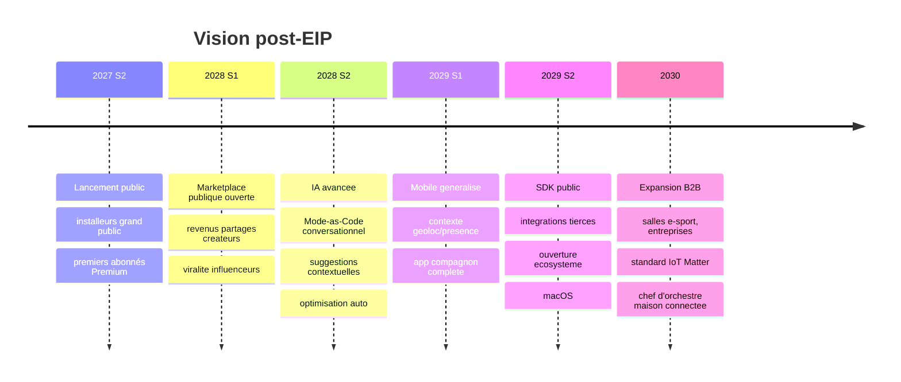

# Roadmap produit — Nexum

> Feuille de route produit alignée sur le **calendrier EIP** (juillet 2026 → juillet 2027) et sur la **vision post-EIP**.
> Deux pistes menées en parallèle : **Technique** et **Entrepreneuriat** (track de l'équipe). Le jury note les deux.
> Jalons qui comptent : **BTP = janvier 2027**, **Greenlight blanc = avril 2027**, **Greenlight Jury + RNCP = juillet 2027 (démo LIVE obligatoire, aucune vidéo)**.
>
> Dernière mise à jour : 2026-07-13. Source de vérité : `_BRIEF_PROJET.md` + `NEXUM_PLAN_TECHNIQUE_ET_ROADMAP.md`.

---

## 1. Principe directeur de la roadmap

Chaque phase fait avancer **conjointement** :
- le **produit** (features réellement démontrables en live) ;
- les **obligations EIP entrepreneuriat** (interviews, BMC, KPIs, itérations, roadmap) ;
- les **jalons administratifs EIP** (verrouillage track, BTP, Greenlights).

La cible finale n'est pas « un maximum de features » mais un **produit déployé, testable et démontrable en direct** en juillet 2027, avec la **validation marché** documentée.

---

## 2. Diagramme Gantt (Mermaid)

---

## 3. Phase 0 — Fondations (juillet → octobre 2026)

**Objectif de phase :** poser une architecture saine (le DSL + le moteur + les premiers adapters réels) et **démarrer la validation marché**. On enterre les 3 défauts du prototype (actions factices, front/back désynchronisés, non data-driven).

### Objectifs produit / technique
- Mise en place du **monorepo** + `nexum-schema` (le DSL) + génération de types **TS et Rust** (fin de la désync front/back).
- `nexum-core` : **Engine + Action Registry + Event Bus**, avec tests unitaires (atout RNCP Bloc 5 — QA).
- **3 Adapters réels cross-platform** : System (launch/close app), Audio (**correction prioritaire du bug volume Windows** via Core Audio), Display.
- Persistance **SQLite locale** (offline-first) + CRUD de modes.
- Reconstruction du **dashboard** sur le nouveau modèle (les modes deviennent des données).

### Features livrées (démontrables)
- Créer/éditer un mode en base locale et l'activer avec des actions **réelles** de base (audio, écran, apps) sur Windows et Linux.

### Objectifs entrepreneuriat
- Lancer et mener les **15-20 interviews utilisateurs** (Léo/gamers, Maxime/streamers, Sarah/télétravailleurs).
- Première version du **Business Model Canvas (BMC)**.
- Structurer le panel de **bêta-testeurs** pour les phases suivantes.

### Jalons EIP
- ⚠️ **Verrouillage des objectifs de track : octobre 2026** — track Entrepreneuriat + objectifs complémentaires (Stratégie & Vision ; Image & Message) figés avant cette date.
- Suivi pédago + mentor (cadence 6 semaines en PGE4).

---

## 4. Phase 1 — MVP + rédaction du BTP (octobre 2026 → janvier 2027)

**Objectif de phase :** transformer la promesse produit (no-code + agnostique + IoT) en **MVP réellement utilisable** et rédiger le **Beta Test Plan**.

### Objectifs produit / technique
- **Éditeur de modes no-code (UI)** — la promesse produit devient réelle.
- **1 intégration IoT réelle : Philips Hue** (la plus démonstrative visuellement — effet « waouh »).
- **Intégration Gaming réelle** : Steam via `steam://`, généralisée et data-driven.
- **Auth + sync cloud minimale** (service axum + PostgreSQL).

### Features livrées (démontrables)
- Création no-code d'un mode complet.
- Activation → actions réelles incluant contrôle **Philips Hue** + lancement d'un jeu Steam.
- Compte utilisateur + synchronisation cloud minimale d'un mode.

### Objectifs entrepreneuriat
- **Cycle d'itération n°1** sur les retours d'interviews et de bêta-testeurs (priorisation → ajustements MVP).
- **Rédaction du BTP** : liste exhaustive et **démontrable** des features (voir §7 — cartographie BTP).
- Consolidation du BMC avec les enseignements terrain.

### Jalons EIP
- ⚠️ **Rendu du Beta Test Plan (BTP) : janvier 2027.**

---

## 5. Phase 2 — Itérations + Greenlight blanc (janvier → avril 2027)

**Objectif de phase :** compléter les fonctionnalités différenciantes (automatisation, Marketplace, mobile), **boucler les 2 cycles d'itération** exigés et réussir la **répétition générale**.

### Objectifs produit / technique
- **Moteur d'automatisation SI/ALORS** (event-driven) → démo emblématique « Mode Chill auto après 18h » (persona Sarah).
- **Marketplace v1** : partage + validation par allowlist + **score de risque IA** + statut de modération.
- **Télécommande mobile basique** (Tauri mobile) : activer un mode à distance + source de contexte (géoloc).

### Features livrées (démontrables)
- Un mode qui s'active **tout seul** sur déclencheur horaire.
- Import d'un mode partagé validé depuis la Marketplace.
- Activation d'un mode depuis le téléphone + sync multi-machines.

### Objectifs entrepreneuriat
- **Cycle d'itération n°2** → objectif obligatoire des **2 cycles minimum** rempli ; décision **pivot vs consolidation** argumentée (a priori : consolidation).
- **KPIs + projections financières** (v1) : rétention, conversion premium, MRR, CAC/LTV, hypothèses d'acquisition (Marketplace + influenceurs).
- **Roadmap produit** formalisée (ce document) présentée comme livrable entrepreneurial.

### Jalons EIP
- ⚠️ **Greenlight Jury blanc : avril 2027 (visio, 1h)** — répétition générale, feedback à intégrer avant juillet.

---

## 6. Phase 3 — Finalisation & Greenlight réel (avril → juillet 2027)

**Objectif de phase :** durcir, **déployer pour de vrai** (installeurs signés), finaliser les livrables entrepreneuriaux et **répéter la démo LIVE**.

### Objectifs produit / technique
- **IA Mode-as-Code (démonstrateur)** : langage naturel → LLM → JSON de Mode (DSL) → simulation (`validate()`) → validation capacités → activation. Le LLM ne produit **jamais** de code.
- **Durcissement** (stabilité, gestion d'erreurs, dégradation propre) + **packaging/déploiement** : installeurs **Windows et Linux signés**.
- Finalisation **KPIs, projections financières, roadmap produit**.

### Features livrées (démontrables en live)
- Génération d'un mode par IA à partir d'une phrase.
- Application **déployée et installée** (pas un environnement de dev) sur laquelle tourne toute la démo.

### Objectifs entrepreneuriat
- Dossier de validation marché complet (interviews + 2 itérations + décision argumentée).
- Livrables entrepreneuriaux finalisés : BMC, KPIs + projections, roadmap, éléments Stratégie & Vision et Image & Message.
- Préparation du **pitch** et de la **FAQ jury** (voir `PITCH_PRESENTATION.md`).

### Jalons EIP
- ⚠️ **Répétition de la démo LIVE** (aucune vidéo autorisée) — au moins 2 répétitions chronométrées.
- ⚠️ **Greenlight Jury + Jury RNCP : juillet 2027 (présentiel, Kremlin-Bicêtre / Paris, 1h chacun le même jour).**
- Cadre RNCP validé : **Bloc 5** (assurance qualité), **Bloc 6** (déploiement), **Bloc 7** (gestion de projet).

---

## 7. Cartographie BTP — features à démontrer en live (rappel)

Cible réaliste et impressionnante pour juillet 2027 :

1. Créer/éditer un mode en **no-code** (éditeur visuel).
2. Activer un mode → actions **réelles** : lancer/fermer apps, régler volume + luminosité (Windows **et** Linux).
3. Lancer un jeu via **Steam** depuis un mode.
4. Contrôler une lampe **Philips Hue** réelle (effet visuel devant le jury).
5. **Automatisation** : un mode s'active tout seul sur déclencheur horaire.
6. **Sync cloud** : créer un mode sur une machine, le retrouver sur une autre.
7. **Télécommande mobile** : activer un mode depuis le téléphone.
8. *(Bonus)* **Marketplace** : importer un mode partagé validé.
9. *(Bonus)* **IA** : décrire un mode en langage naturel et le voir généré.

---

## 8. Synthèse jalons EIP

| Date | Jalon | Livrable attendu |
|---|---|---|
| Juil. 2026 | Démarrage Phase 0 | Monorepo + DSL + core, début interviews |
| **Oct. 2026** | **Verrouillage objectifs de track** | Track + objectifs complémentaires figés ; BMC v1 |
| **Jan. 2027** | **Rendu BTP** | Beta Test Plan exhaustif + MVP no-code/Hue/Steam |
| **Avril 2027** | **Greenlight blanc (visio)** | 2 cycles d'itération, automatisation, Marketplace v1, KPIs v1 |
| **Juil. 2027** | **Greenlight + RNCP (présentiel)** | Produit déployé signé + démo LIVE + tous livrables entrepreneuriat |

---

## 9. Vision produit post-EIP (au-delà de juillet 2027)

> Nexum ambitionne de devenir la **couche d'orchestration universelle** de l'environnement numérique — le point de contrôle unique du joueur, du créateur et du télétravailleur.

### 9.1 Marketplace publique
- Ouverture au grand public : catalogue de modes créés par la communauté.
- **Revenus partagés** avec les créateurs, commission Nexum sur les presets premium.
- Moteur d'acquisition à faible coût (chaque créateur populaire = un canal). Renforce l'effet réseau et le fossé défensif.

### 9.2 IA avancée
- **Mode-as-Code conversationnel** (dialogue itératif pour affiner un mode).
- **Suggestions contextuelles** (proposer un mode selon les habitudes) et **optimisation automatique** des paramètres.
- Toujours dans le garde-fou : l'IA produit uniquement du **DSL déclaratif validé**, jamais du code.

### 9.3 Mobile généralisé
- De la simple télécommande vers une **app compagnon complète** : gestion des modes, contexte (géoloc/présence) comme déclencheur natif, notifications.

### 9.4 Expansion
- **SDK public** : n'importe quelle marque/développeur crée son Adapter → écosystème ouvert.
- **macOS** en support de première classe (au-delà du bonus).
- **B2B** : licences volume pour salles e-sport et entreprises (séparation pro/perso).
- Pari **Matter** (standardisation IoT) : Nexum comme **chef d'orchestre naturel** de la maison connectée du joueur.

---

## 10. Risques transverses & mitigations (rappel)

| Risque | Mitigation |
|---|---|
| Dépendance API tierces (Steam, Hue…) | Adapters isolés + dégradation propre (`on_error`, capacités). |
| Anti-cheat | Aucune injection ; uniquement API/SDK officiels. |
| Réaction des OS (profils natifs) | Valeur = orchestration cross-marque + IA, pas un simple profil. |
| Volume de dev | Architecture par Adapters = ajout incrémental ; prioriser 4-5 intégrations pour le BTP. |
| Bug volume Windows (hérité du prototype) | Corrigé en Phase 0 (Core Audio via crate `windows`). |
| Coût cross-platform | Core OS-agnostique testé en CI ; seul un Adapter par OS a du code spécifique. |

> ⚠️ Avant chaque jalon, mettre à jour ce document avec l'**avancement réel** (features livrées vs prévues) et les **chiffres réels** (interviews, bêta-testeurs, KPIs).
