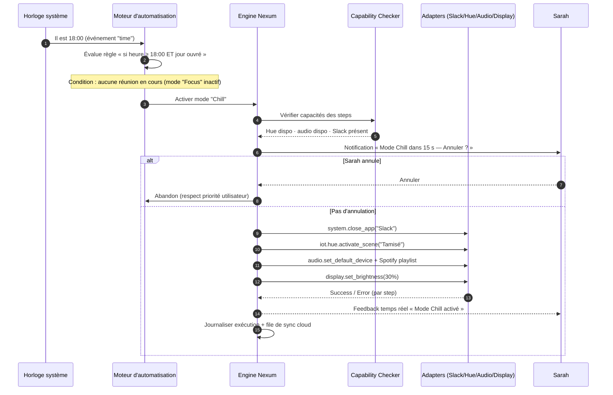
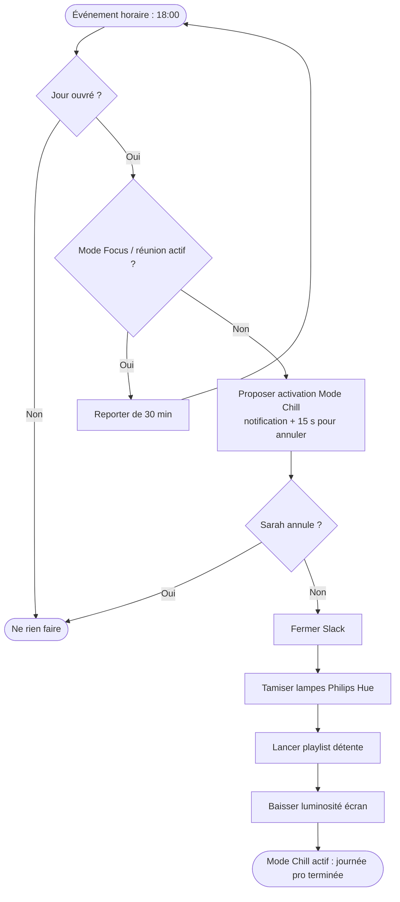

# Personas & parcours utilisateurs (user journeys) — Nexum

> Document EIP (piste Entrepreneuriat / Image & Message).
> Cohérent avec `_BRIEF_PROJET.md` et `NEXUM_PLAN_TECHNIQUE_ET_ROADMAP.md`.
> Objet : incarner la cible via 3 personas, cartographier leurs parcours (journey maps),
> et illustrer le scénario d'automatisation phare du jury.
> Langue : français. Dernière mise à jour : 2026-07-13.

---

## 1. Vue d'ensemble

Nexum s'adresse à trois segments, incarnés par trois personas issus du brief. Le point commun : **un même PC qui doit endosser plusieurs rôles**, et une friction à chaque bascule.

| Persona | Segment | Âge | Besoin dominant | Fonction Nexum clé |
|---|---|---|---|---|
| **Léo Bernard** | Gamer compétitif | 22 | Performance & rapidité, zéro friction avant une ranked | Mode « Ranked » en 1 clic (kill process, RGB, audio) |
| **Maxime Roux** | Streamer Twitch | 28 | Lancer un direct fiable sans rien oublier | Mode « Direct » (OBS, scènes, Spotify, lumières, retour) |
| **Sarah Martin** | Développeuse télétravail | 34 | Séparer pro/perso, décompresser le soir | Mode « Chill » **automatique** après 18 h |

---

## 2. Persona 1 — Léo Bernard, le gamer compétitif

<table>
<tr><td><b>Profil</b></td><td>22 ans, étudiant, joue 20 h+/semaine. Valorant et League of Legends en ranked. Setup multi-marques : souris Logitech, clavier Razer, casque SteelSeries, bandeau LED générique, écran 240 Hz.</td></tr>
<tr><td><b>Niveau technique</b></td><td>Élevé côté jeu, moyen côté système. A déjà testé des scripts mais « pas le temps de m'embêter ».</td></tr>
<tr><td><b>Objectifs</b></td><td>• Maximiser les FPS et la réactivité. • Être « in-game » le plus vite possible. • Ambiance immersive (lumières) sans reflets sur l'écran.</td></tr>
<tr><td><b>Frustrations</b></td><td>• Fermer manuellement Chrome, Discord updater, Spotify, apps de fond avant de jouer. • Régler le volume, couper les notifs, ajuster le RGB à chaque fois. • Temps de préparation qui casse l'élan ; manche parfois lancée « pas prêt ». • Reflets/lumières mal réglés.</td></tr>
<tr><td><b>Citation</b></td><td>« Avant chaque ranked je perds deux minutes à fermer des trucs et à régler mon son. Une fois sur deux j'oublie un process qui fait ramer, et ça se voit sur mon aim. »</td></tr>
<tr><td><b>Ce qui le convaincrait</b></td><td>Un vrai gain de perf mesurable + aucune détection anti-cheat (API officielles uniquement).</td></tr>
<tr><td><b>Frein principal</b></td><td>Peur qu'une app tierce soit vue comme de la triche par l'anti-cheat.</td></tr>
</table>

### 2.1 Journey map — Léo
| Étape | Actions de Léo | Points de contact | Émotions | Douleurs | Opportunités Nexum |
|---|---|---|---|---|---|
| **Prise de conscience** | Voit un streamer utiliser un « mode ranked » ; en discute sur Discord. | Discord, Twitch, TikTok gaming | Curieux, sceptique | « Encore un logiciel de plus ? » | Preuve sociale via influenceurs ; message clair « perf + zéro friction ». |
| **Onboarding** | Télécharge, installe, autorise l'accès système ; détection auto des périphériques. | Site, installeur Windows signé, écran d'accueil | Impatient, un peu méfiant | Peur des permissions ; ne veut pas configurer 1 h | Détection auto des devices multi-marques ; mode « Ranked » pré-rempli ; réassurance anti-cheat affichée. |
| **Création d'un mode** | Ajuste le mode « Ranked » : ferme Chrome/Spotify, volume 70 %, RGB rouge, luminosité max. | Éditeur no-code (catalogue d'actions) | Surpris que ce soit simple | Ne veut pas coder ni lire une doc | Éditeur no-code drag-and-drop ; catalogue d'`action_types` ; simulation avant activation. |
| **Usage quotidien** | Clique « Ranked » avant chaque session ; tout bascule en 2 s. | Dashboard, raccourci, feedback temps réel | Satisfait, gain de temps réel | — (friction supprimée) | Feedback temps réel step par step ; fiabilité ; futur trigger « au lancement de Valorant ». |
| **Partage / Marketplace** | Publie son mode « Valorant Pro » ; récupère des presets d'autres joueurs. | Marketplace, ratings | Fier, valorisé | Doute sur la sûreté des presets importés | Marketplace sécurisée (JSON validé, score de risque, réputation) ; viralité entre joueurs. |

---

## 3. Persona 2 — Maxime Roux, le streamer

<table>
<tr><td><b>Profil</b></td><td>28 ans, streamer Twitch semi-pro (~800 viewers moyens), 4 soirs/semaine. Utilise OBS, Spotify, Stream Deck, lumières connectées, retour caméra, alertes.</td></tr>
<tr><td><b>Niveau technique</b></td><td>Bon, mais sa vraie compétence c'est l'animation, pas la config. Chaque minute de setup = du direct en moins.</td></tr>
<tr><td><b>Objectifs</b></td><td>• Lancer « Direct » en un clic, sans rien oublier. • Setup fiable et reproductible (rien qui plante en live). • Ambiance visuelle cohérente (lumières = branding).</td></tr>
<tr><td><b>Frustrations</b></td><td>• Enchaînement manuel : OBS + scènes + Spotify + lumières + micro + retour + fermer notifs perso. • Oublis en direct (micro coupé, notif Discord perso à l'écran, mauvaise scène). • Stress d'avant-live.</td></tr>
<tr><td><b>Citation</b></td><td>« Le pire c'est de se rendre compte 10 minutes après le début que le micro n'était pas sur la bonne sortie, ou qu'une notif perso s'est affichée devant tout le monde. »</td></tr>
<tr><td><b>Ce qui le convaincrait</b></td><td>Fiabilité totale + gain d'image (transitions léchées, lumières synchronisées).</td></tr>
<tr><td><b>Frein principal</b></td><td>Ne peut pas se permettre un outil qui plante en plein direct.</td></tr>
</table>

### 3.1 Journey map — Maxime
| Étape | Actions de Maxime | Points de contact | Émotions | Douleurs | Opportunités Nexum |
|---|---|---|---|---|---|
| **Prise de conscience** | Cherche à professionnaliser son setup ; voit Nexum recommandé dans une commu de streamers. | Discord streamers, YouTube tuto, X | Intéressé, exigeant | Méfiant après des outils instables | Positionnement « lance ton Direct en 1 clic » ; démonstration lumières + OBS. |
| **Onboarding** | Installe, connecte OBS, Spotify, pont lumières, Stream Deck. | Installeur, écrans de connexion d'intégrations | Motivé, un peu tendu | Multiplicité des connexions à faire | Assistants de connexion par intégration ; test de chaque device ; dégradation propre si une API manque. |
| **Création d'un mode** | Construit « Direct » : ouvre OBS scène départ, lance Spotify playlist, lumières « Live », micro sur bonne sortie, ferme Discord perso. | Éditeur no-code, catalogue d'actions | Concentré, rassuré | Peur d'un oubli dans la séquence | Séquence ordonnée d'actions + `on_error` par step ; simulation ; checklist visuelle. |
| **Usage quotidien** | Un clic « Direct » 30 s avant l'antenne ; « Fin de live » pour tout ranger. | Dashboard, Stream Deck, feedback temps réel | Serein, pro | Anxiété résiduelle du live | Feedback step par step (chaque action confirmée) ; fiabilité = argument central. |
| **Partage / Marketplace** | Publie « Setup Stream Twitch » ; ses viewers l'importent. | Marketplace, réseaux | Valorisé, influenceur | Veut protéger sa « recette » | Marketplace + réputation créateur ; effet viralité (levier d'acquisition du brief). |

---

## 4. Persona 3 — Sarah Martin, la télétravailleuse

<table>
<tr><td><b>Profil</b></td><td>34 ans, développeuse en télétravail 4 j/sem. Même PC pour coder le jour et se détendre le soir (séries, jeux indé, musique). Lampes Philips Hue, casque, Slack, VS Code, Spotify.</td></tr>
<tr><td><b>Niveau technique</b></td><td>Élevé, mais ne VEUT pas bricoler des scripts pour sa vie perso. Cherche la tranquillité.</td></tr>
<tr><td><b>Objectifs</b></td><td>• Séparation nette pro/perso sur une seule machine. • Décrocher vraiment le soir (santé mentale). • Que l'ambiance change toute seule, sans y penser.</td></tr>
<tr><td><b>Frustrations</b></td><td>• Slack qui notifie à 21 h → n'arrive pas à décrocher. • Reste « en mode boulot » car rien ne marque la coupure. • Devoir penser à fermer les outils pro et créer une ambiance détente.</td></tr>
<tr><td><b>Citation</b></td><td>« À 18 h je suis censée avoir fini, mais Slack continue de clignoter et je me remets à bosser. J'aimerais que mon bureau me dise, tout seul, que la journée est terminée. »</td></tr>
<tr><td><b>Ce qui la convaincrait</b></td><td>Automatisation contextuelle fiable + respect de la vie privée (données locales).</td></tr>
<tr><td><b>Frein principal</b></td><td>Ne veut pas qu'un logiciel change des choses de façon intempestive ou intrusive.</td></tr>
</table>

### 4.1 Journey map — Sarah
| Étape | Actions de Sarah | Points de contact | Émotions | Douleurs | Opportunités Nexum |
|---|---|---|---|---|---|
| **Prise de conscience** | Lit un article sur le droit à la déconnexion / séparation pro-perso en télétravail. | Article blog, LinkedIn, bouche-à-oreille | Concernée, en quête de solution | Charge mentale de fin de journée | Message « sépare ton travail et ta vie, automatiquement » ; angle bien-être. |
| **Onboarding** | Installe, connecte ses lampes Hue, autorise gestion apps/audio. | Installeur, connexion Hue | Prudente | Sensible à la vie privée | Offline-first / données locales (SQLite) mises en avant ; connexion Hue guidée. |
| **Création d'un mode** | Crée « Chill » : coupe Slack, tamise les Hue, lance Spotify playlist calme, baisse la luminosité. | Éditeur no-code | Apaisée par la simplicité | Ne veut pas configurer longtemps | Éditeur no-code ; futur « décris ton mode en langage naturel » (IA Mode-as-Code). |
| **Usage quotidien** | Définit une **règle** : à 18 h, activer « Chill » automatiquement. Le soir, tout bascule sans elle. | Moteur d'automatisation, notification, dashboard | Soulagée, déconnecte enfin | Peur du déclenchement au mauvais moment (en réunion tardive) | Règle SI/ALORS (heure) + conditions ; notification « Mode Chill activé » avec annulation en 1 clic ; priorité utilisateur. |
| **Partage / Marketplace** | Récupère un preset « Deep Work » pour ses heures de focus. | Marketplace | Curieuse, confiante | Doute sur la fiabilité d'un preset tiers | Marketplace sécurisée (allowlist + score de risque) ; presets « travail » et « détente ». |

---

## 5. Parcours phare — « Mode Chill automatique après 18 h » (Sarah)

Ce scénario est le **démonstrateur d'automatisation** identifié dans la roadmap (§5 et BTP §10 du plan technique). Il illustre le moteur d'automatisation event-driven : un **trigger horaire** déclenche l'activation d'un `mode_id` cible, exécuté step par step par l'Engine et les Adapters.

### 5.1 Diagramme de séquence (déclenchement & exécution)

### 5.2 Logique de la règle (flowchart)

---

## 6. Empathy Map — Sarah Martin (télétravailleuse)

> L'empathy map complète le persona : elle rend explicite le vécu quotidien qui justifie le besoin d'automatisation.

| Quadrant | Contenu |
|---|---|
| **PENSE & RESSENT** (ce qui compte vraiment) | « Je n'arrive pas à décrocher. » — Culpabilité de rester connectée / culpabilité de s'arrêter. Fatigue mentale. Envie d'une frontière claire entre pro et perso. Attachement à sa vie privée et à ses données. |
| **VOIT** (environnement, entourage) | Un seul bureau qui sert de bureau pro le jour et d'espace détente le soir. Slack qui clignote après les heures. Des collègues toujours en ligne tard. Des outils domotiques (Hue) qu'elle sous-exploite. Des articles sur le burn-out et la déconnexion. |
| **ENTEND** (influences) | « Le télétravail brouille les frontières. » Retours de proches : « tu bosses encore ? ». Discours entreprise sur le droit à la déconnexion. Recommandations d'outils de bien-être numérique. |
| **DIT & FAIT** (comportement observable) | Ferme (parfois) Slack à la main, tamise ses lampes, lance de la musique — de manière inconstante. Répond « je finis un truc » à 20 h. Bricole peu de solutions car elle refuse de « scripter sa vie perso ». |
| **PAINS** (douleurs) | Impossibilité de couper mentalement. Notifications intrusives le soir. Charge mentale de la transition pro→perso. Aucun rituel de fin de journée. Crainte des logiciels intrusifs qui changent tout sans prévenir. |
| **GAINS** (bénéfices recherchés) | Une coupure nette et automatique à 18 h. Une ambiance qui signale « la journée est finie ». Tranquillité d'esprit et respect de sa vie privée (données locales). Garder le contrôle (pouvoir annuler/reporter). Meilleur équilibre, moins de fatigue. |

> **Traduction produit :** la règle horaire → `mode Chill` (moteur d'automatisation SI/ALORS), avec **notification + annulation** et **priorité utilisateur** pour lever la peur de l'intrusion, et **offline-first** pour l'argument vie privée. C'est exactement l'un des scénarios de démonstration live prévus pour le Greenlight Jury (juillet 2027).
