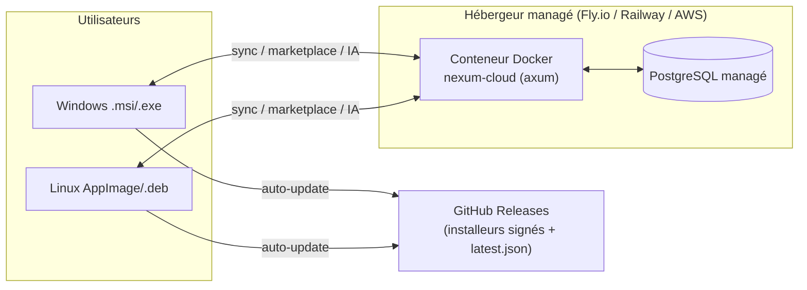
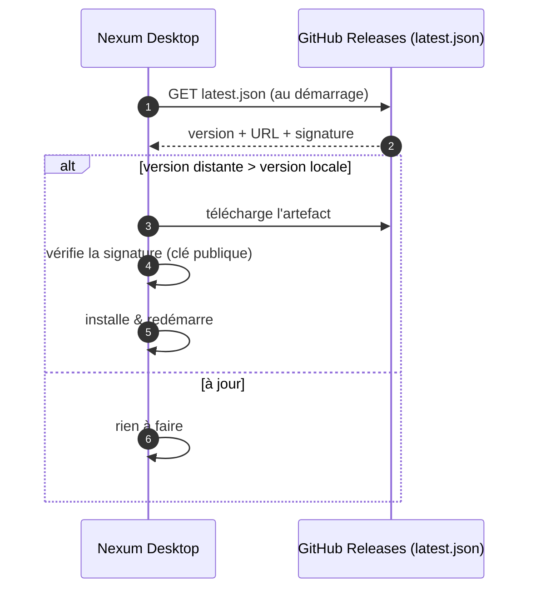
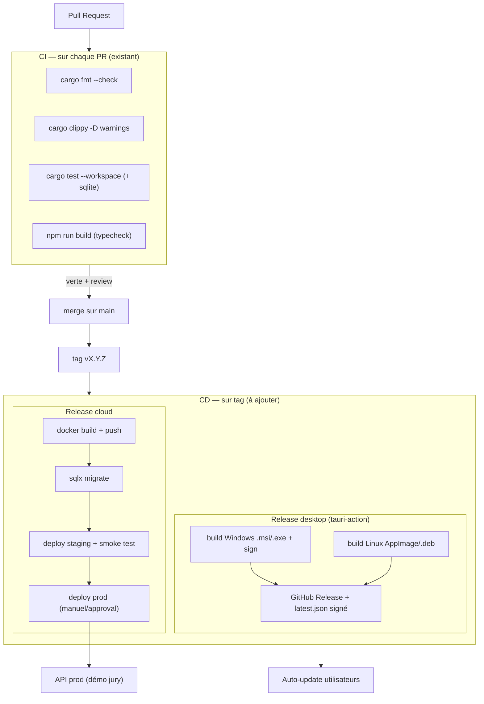

# Déploiement & CI/CD — Nexum

> **RNCP — Bloc 6 : Déployer un projet de développement.**
> Document jury-ready. Source de vérité factuelle : `docs/eip/_BRIEF_PROJET.md`,
> `NEXUM_PLAN_TECHNIQUE_ET_ROADMAP.md`, `README.md`, `.github/workflows/ci.yml`.
> Dernière mise à jour : 2026-07-13. Objectif contractuel : **démo LIVE du projet déployé** au
> Greenlight Jury + RNCP de **juillet 2027** (aucune vidéo autorisée).

---

## 1. Vue d'ensemble

Nexum a **deux artefacts déployables** de nature très différente :

1. **L'application desktop** (Tauri 2 + React) — distribuée aux utilisateurs sous forme
   d'**installeurs signés** (Windows `.msi`/`.exe`, Linux AppImage/`.deb`), avec **auto-update**.
2. **Le service cloud** (`nexum-cloud`, API Rust axum + PostgreSQL) — déployé en **conteneur Docker**
   chez un hébergeur managé, pour la sync, la Marketplace et l'IA Mode-as-Code.

L'app est **offline-first** (SQLite local) : elle fonctionne sans le cloud, ce qui **sécurise la démo
live** (une panne réseau devant le jury ne casse pas le cœur produit). Le cloud n'est requis que pour
la sync cross-machine, le partage Marketplace et l'IA.



---

## 2. Environnements

| Env | But | App desktop | Cloud | Base de données |
|---|---|---|---|---|
| **dev** | Développement local | `npm run tauri dev` | `cargo run -p nexum-cloud` (localhost:8787) | SQLite local + Postgres Docker local |
| **staging** | Pré-prod, tests d'intégration & répétition de démo | Build de pré-release (canal `beta`) | Conteneur déployé sur env staging | PostgreSQL managé (instance staging) |
| **prod** | Utilisateurs finaux & **démo jury** | Installeurs signés (canal `stable`) | Conteneur prod (auto-scale léger) | PostgreSQL managé (instance prod, backups) |

- Séparation stricte par **secrets/URLs distincts** (voir §9) et par **canal d'update** (`beta` vs
  `stable`) pour ne jamais pousser une pré-release aux utilisateurs.
- **Hypothèse :** staging et prod partagent la même config d'infra (Infrastructure-as-Code) pour
  éviter les dérives ; seul le contenu des variables change.

---

## 3. Stratégie de release

### 3.1 Versionnage — SemVer

`MAJEUR.MINEUR.CORRECTIF` (ex. `1.4.2`). Avant le premier jury : phase `0.x` (API instable assumée).
Une version `1.0.0` est visée pour la **démo de juillet 2027**. Les pré-releases utilisent les
suffixes `-beta.N` / `-rc.N`.

Compatibilité clé à versionner : le **DSL `nexum-schema`**. Une évolution incompatible du schéma de
Mode = bump **MAJEUR** (impacte modes persistés, sync et Marketplace).

### 3.2 Modèle de branches

- `main` (= `master`) : **toujours déployable**, protégé (CI verte + review obligatoires, cf. Bloc 5).
- `feature/*`, `fix/*` : branches de travail → PR vers `main`.
- **Tags `vX.Y.Z`** : une release est déclenchée par la **pose d'un tag** annoté sur `main`.
- **Hypothèse :** modèle « trunk-based léger » (pas de branches `release/*` long-vivantes), adapté à
  une équipe EIP restreinte.

### 3.3 Du tag à la release

```
merge PR sur main → CI verte → tag vX.Y.Z → workflow release
  → build multi-OS des installeurs → signature → GitHub Release
  → build + push image Docker → déploiement cloud staging → prod
```

---

## 4. Packaging desktop (Tauri)

Tauri produit des installeurs **natifs et légers** (l'argument « empreinte minimale / Rust » du radar
produit). Build via **`tauri-action`** (GitHub Actions) sur runners natifs.

| Plateforme | Artefacts | Runner CI | Signature |
|---|---|---|---|
| **Windows** | `.msi` (WiX) + `.exe` (NSIS) | `windows-latest` | **Authenticode** (certificat code-signing ; idéalement EV/OV). *Hypothèse : certificat acquis en Phase 3 ; sinon fallback auto-signé documenté pour la démo.* |
| **Linux** | **AppImage** + **`.deb`** | `ubuntu-latest` (deps : `libwebkit2gtk`, `libdbus`, `pactl`) | Signature GPG du dépôt/`.deb` (optionnel) |
| **macOS** (bonus) | `.dmg`/`.app` | `macos-latest` | Signature + notarisation Apple (hors périmètre V1) |

**Signature — pourquoi c'est critique pour le jury :** sans signature, Windows SmartScreen affiche un
avertissement bloquant à l'installation. Un installeur signé est un **argument de professionnalisme**
et évite un incident pendant la démo live.

---

## 5. Auto-update Tauri

Nexum utilise le **plugin `updater` officiel de Tauri 2** :

- À chaque release, la CI génère les binaires **et** un manifeste `latest.json` (versions, URLs,
  **signatures** des artefacts) publié sur **GitHub Releases**.
- L'app vérifie ce manifeste au démarrage ; si une version plus récente existe, elle télécharge,
  **vérifie la signature cryptographique** (clé publique embarquée à la compilation) puis applique la
  mise à jour.
- **Deux canaux** : `stable` (utilisateurs) et `beta` (staging / testeurs BTP).
- La vérification de signature Tauri est **indépendante** du code-signing OS : elle garantit que
  l'update provient bien de l'équipe, même si le certificat OS manque.



---

## 6. Déploiement du service cloud

### 6.1 Conteneurisation

`nexum-cloud` (axum) est packagé en **image Docker** multi-stage :

```dockerfile
# build
FROM rust:1-slim AS build
WORKDIR /app
COPY . .
RUN cargo build --release -p nexum-cloud
# runtime (léger)
FROM debian:stable-slim
COPY --from=build /app/target/release/nexum-cloud /usr/local/bin/
EXPOSE 8787
CMD ["nexum-cloud"]
```

- Image finale minimale (binaire Rust statique-ish → faible surface, démarrage rapide).
- Endpoint de **healthcheck** déjà présent : `GET /health` (cf. README), utilisé par
  l'orchestrateur pour le liveness/readiness.

### 6.2 Hébergement

| Option | Pourquoi | Verdict |
|---|---|---|
| **Fly.io** | Déploiement Docker simple, régions EU (RGPD), Postgres managé, coût faible | **Recommandé** pour l'EIP |
| **Railway** | UX très simple, bon pour prototype/staging | Alternative |
| **AWS** (ECS/Fargate + RDS) | Cité dans le business model ; scalable | Overkill avant traction, garder pour l'après-EIP |

> **Hypothèse retenue :** Fly.io (ou Railway) pour dev/staging/prod pendant l'EIP, avec migration AWS
> possible plus tard (le business model mentionne AWS/Azure). L'app étant conteneurisée, l'hébergeur
> est interchangeable.

### 6.3 Base de données

- **PostgreSQL managé** (backups automatiques, chaînes de connexion via secrets).
- **Migrations** versionnées avec **`sqlx migrate`** (ou `refinery`), exécutées au déploiement.
- **RGPD** (exigé par l'étude de marché) : export/suppression de données, hébergement **UE**,
  chiffrement au repos fourni par l'hébergeur managé.
- Schéma repris de `docs/GRAPHES_ARCHITECTURE_BDD.md` (USERS, MODES, MODE_ACTIONS,
  AUTOMATION_RULES, MODE_EXECUTIONS, SHARED_MODES, MODE_RATINGS, DEVICES).

---

## 7. Pipeline CI/CD complet

La CI **actuelle** (`.github/workflows/ci.yml`, jobs `core` + `frontend`, cf. Bloc 5) couvre déjà
**build/test/lint/typecheck** sur chaque PR. Le pipeline de **livraison** (CD) ci-dessous s'ajoute,
déclenché par un **tag `vX.Y.Z`**.



**Étapes de gouvernance :**
- Déploiement **prod du cloud** derrière une **approbation manuelle** (GitHub Environments) — évite un
  déploiement accidentel avant la démo.
- **Smoke test** post-déploiement staging : `GET /health` + un scénario de sync minimal doit réussir
  avant de promouvoir en prod.

---

## 8. Rollback

| Composant | Stratégie de rollback |
|---|---|
| **Cloud (Docker)** | Images **immuables taguées** par version → redéployer l'image `N-1` en une commande. Fly.io/Railway conservent l'historique des déploiements (rollback 1-clic). |
| **Base de données** | Migrations **réversibles** (`down`) + **backup** managé avant migration ; restauration point-in-time si nécessaire. Règle : jamais de migration destructive irréversible sans backup vérifié. |
| **App desktop** | L'auto-update ne pousse jamais une version non validée (canal `stable`). En cas de régression, on publie une **version correctrice supérieure** (SemVer) — pas de « downgrade » ; on ne dépublie que via retrait de la Release. |
| **Feature risquée** | **Feature flags** côté cloud pour désactiver à chaud (ex. IA Mode-as-Code) sans redéploiement. *Hypothèse : mécanisme simple via variable d'env.* |

---

## 9. Secrets management

- **Développement :** fichiers `.env` **non commités** (`.gitignore`), `.env.example` fourni.
- **CI/CD :** **GitHub Actions Secrets** / **Environments** (certificat de signature Windows + mot de
  passe, clé privée `updater` Tauri, token de déploiement Fly.io, URL/credentials PostgreSQL, clé API
  du fournisseur LLM pour l'IA).
- **Runtime cloud :** variables d'environnement injectées par l'hébergeur (secrets managés), jamais
  dans l'image Docker.
- **Principes :** aucun secret dans le code ni les logs ; rotation possible ; portée minimale (un
  secret staging ≠ secret prod) ; la clé **privée** de l'updater ne quitte jamais la CI.

---

## 10. Monitoring & observabilité

| Besoin | Moyen |
|---|---|
| **Logs** | Logging structuré Rust via **`tracing`** (JSON en prod) → agrégés par l'hébergeur (Fly/Railway logs) ou un service type Grafana Loki. |
| **Uptime** | Sonde externe (**UptimeRobot** / Better Stack) sur `GET /health` + alerte (email/Discord). |
| **Métriques** | Endpoint `/metrics` (Prometheus) — latence, taux d'erreur, sync/min. *Hypothèse : Phase 3.* |
| **Erreurs app desktop** | Remontée **opt-in** (consentement RGPD) des crashs anonymisés vers le cloud. |
| **Santé DB** | Métriques de l'instance managée (connexions, CPU) + alertes de l'hébergeur. |

Objectif jury : pouvoir **montrer que le service est vivant** (dashboard uptime + `/health` vert)
pendant la démo — preuve d'un déploiement réel et supervisé, pas d'un localhost.

---

## 11. Alignement calendrier EIP

| Jalon EIP | Livrable déploiement associé |
|---|---|
| **Phase 0** (juil.→oct. 2026) | CI en place (fait), Dockerfile cloud, déploiement staging minimal. |
| **BTP — janvier 2027** | Cloud staging déployé + sync minimale démontrable ; premiers installeurs non signés (canal beta). |
| **Greenlight blanc — avril 2027** | Pipeline CD complet (release desktop + cloud), auto-update fonctionnel, staging stable — répétition générale. |
| **Greenlight + RNCP — juillet 2027** | **Prod déployée et supervisée** : installeurs **signés** (Win + Linux), auto-update `stable`, cloud sur hébergeur managé + PostgreSQL, monitoring visible. **Démo LIVE** de bout en bout : installer → activer un mode → sync cross-machine → automatisation → Marketplace. |

---

## 12. Synthèse pour le jury (Bloc 6)

Nexum présente une chaîne de déploiement **complète et crédible** :
- un pipeline **CI déjà opérationnel** (build/test/lint/typecheck bloquants) prolongé par un **CD**
  déclenché par tag SemVer ;
- deux artefacts maîtrisés : **installeurs desktop signés + auto-update Tauri** et **service cloud
  conteneurisé** sur hébergeur managé avec **PostgreSQL** ;
- des pratiques de production réelles : environnements séparés, rollback, gestion des secrets,
  monitoring/uptime, conformité RGPD (hébergement UE) ;
- le tout aligné sur l'échéance non négociable : une **démo live du produit déployé en juillet 2027**.
