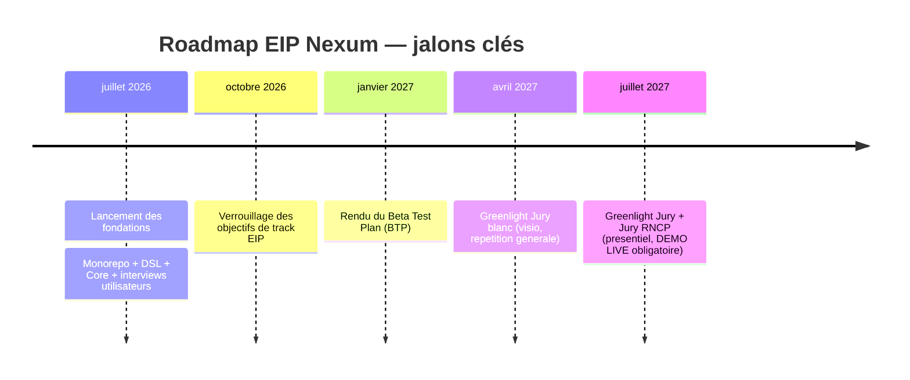
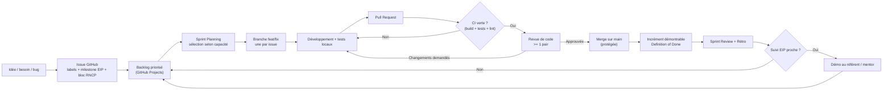

# Gestion de projet & organisation d'équipe — Nexum

> Document RNCP — **Bloc 7 (Gestion de projet)**.
> Projet EIP Epitech « Nexum » — PROMO 2028, Phase PGE4, campus Marseille — intra : eip.epitech.eu/project/1035.
> Langue des livrables : français.
> Dernière mise à jour : 2026-07-13.
>
> ⚠️ Les éléments marqués ⚠️ sont des informations à compléter par l'équipe (noms, disponibilités, liens).

---

## 1. Objet et périmètre du document

Ce document décrit **comment l'équipe Nexum s'organise pour construire, piloter et livrer** le projet sur toute la durée de l'EIP (juillet 2026 → juillet 2027). Il couvre :

- la **méthodologie** de travail (Agile adapté à une équipe étudiante) ;
- les **rôles & responsabilités** (matrice RACI) ;
- l'**outillage** (GitHub, communication, documentation) ;
- les **rituels** d'équipe et leur cadence ;
- la **gestion des tâches et du backlog** ;
- la **communication** interne et avec le référent pédagogique / mentor ;
- les **jalons** alignés sur le calendrier EIP.

Il est pensé pour être **présentable en l'état devant le jury** (Greenlight blanc avril 2027, Greenlight + Jury RNCP juillet 2027).

---

## 2. Méthodologie : un Agile « Scrum-lite » adapté à une équipe étudiante

### 2.1 Pourquoi pas du Scrum « pur »

Une équipe EIP n'est **pas** une équipe produit à plein temps : les membres ont des cours, des périodes de stage, des indisponibilités décalées, et pas de Product Owner externe. Appliquer Scrum à la lettre (daily synchrone quotidien, rôle de Scrum Master dédié à temps plein, estimation en story points rigoureuse) serait contre-productif.

Nous adoptons donc un **Scrum-lite** : on garde ce qui crée de la valeur (itérations courtes, backlog priorisé, revue et rétrospective régulières, transparence) et on allège ce qui suppose une disponibilité continue (daily **asynchrone** plutôt que synchrone, estimation légère en tailles de T-shirt).

### 2.2 Cadence retenue

| Élément | Choix Nexum | Justification |
|---|---|---|
| **Longueur de sprint** | **2 semaines** | Assez court pour corriger le cap vite, assez long pour livrer un incrément démontrable malgré les cours. |
| **Daily** | **Asynchrone** (écrit, sur Discord/Teams) | Emplois du temps non alignés → un point écrit quotidien évite de bloquer sur un créneau commun. |
| **Sprint review + rétro** | Fin de chaque sprint (synchrone, ~1h) | Un seul créneau synchrone à caler par quinzaine, plus tenable. |
| **Alignement EIP** | Suivi pédago + mentor **toutes les 6 semaines en PGE4**, **mensuel en PGE5** | Cadence imposée par Epitech (source : brief projet). Chaque suivi tombe en fin de sprint pour présenter un incrément. |

> **Hypothèse :** l'équipe compte 5 à 6 membres (taille EIP usuelle). Ajuster les rôles ci-dessous au nombre réel. ⚠️

### 2.3 Alignement sprints ↔ suivis EIP

- En **PGE4**, un suivi tombe environ toutes les **6 semaines**, soit **~1 suivi tous les 3 sprints**. On prépare une démo d'incrément à chaque suivi.
- En **PGE5**, suivi **mensuel**, soit **~1 suivi tous les 2 sprints**.
- La planification de sprint tient compte de la **date du prochain suivi** : le dernier sprint avant un suivi priorise ce qui est **démontrable**.

---

## 3. Rôles & responsabilités

### 3.1 Rôles de l'équipe

L'équipe étant réduite, chaque membre porte un **rôle projet** (casquette d'organisation) **en plus** de son travail de développement. Les rôles tournent si besoin.

| Rôle | Mission principale | Titulaire |
|---|---|---|
| **Chef de projet / Coordination** | Pilote le planning, l'interface avec le référent EIP, l'ordre du jour des rituels. | ⚠️ *à compléter* |
| **Lead technique (Core/Rust)** | Garant de l'architecture (Core, Adapters, DSL), arbitrage technique. | ⚠️ *à compléter* |
| **Lead Frontend / UX** | Éditeur no-code, dashboard, cohérence UX. | ⚠️ *à compléter* |
| **Lead Cloud / DevOps** | Service axum, PostgreSQL, CI/CD, déploiement, sync. | ⚠️ *à compléter* |
| **Référent Entrepreneuriat (track EIP)** | Interviews utilisateurs, BMC, KPIs, projections, roadmap produit. | ⚠️ *à compléter* |
| **Référent Qualité / QA (Bloc 5)** | Tests, revues de code, définition du « Done ». | ⚠️ *à compléter* |

> ⚠️ **À compléter :** noms, e-mails Epitech, et **disponibilités hebdomadaires** de chaque membre (heures/semaine, périodes de stage/indispo). Sans cette donnée, la capacité de sprint ne peut pas être estimée finement.

### 3.2 Matrice RACI

Légende : **R** = Responsable (fait), **A** = Approbateur (rend des comptes, décide), **C** = Consulté, **I** = Informé.

| Activité / Livrable | Chef de projet | Lead Technique | Lead Frontend | Lead Cloud | Réf. Entrepreneuriat | Réf. QA |
|---|:--:|:--:|:--:|:--:|:--:|:--:|
| Planification de sprint | A/R | C | C | C | C | C |
| Architecture technique (DSL, Core, Adapters) | I | A/R | C | C | I | C |
| Développement Frontend (éditeur no-code) | I | C | A/R | I | C | C |
| Développement Cloud (API, sync, DB) | I | C | I | A/R | I | C |
| Intégrations / Adapters (Hue, Steam…) | I | A | C | R | I | C |
| Stratégie CI/CD & déploiement | I | C | I | A/R | I | C |
| Assurance qualité, revues de code, tests | I | C | C | C | I | A/R |
| Interviews utilisateurs & validation marché | C | I | C | I | A/R | I |
| Business Model Canvas / KPIs / projections | C | I | I | I | A/R | I |
| Rédaction du BTP (janvier 2027) | A/R | C | C | C | C | C |
| Préparation démo live (Greenlight) | A/R | C | C | C | C | C |
| Relation référent pédago / mentor EIP | A/R | I | I | I | C | I |
| Documentation projet | A | C | C | C | C | R |

> ⚠️ **À compléter :** valider cette matrice en équipe et l'ajuster selon les affinités réelles. Un même membre peut cumuler deux rôles si l'équipe fait moins de 6 personnes.

---

## 4. Outils

### 4.1 Gestion du travail — GitHub

| Outil | Usage chez Nexum |
|---|---|
| **GitHub Projects** | Board Kanban unique (backlog → à faire → en cours → revue → fait) + vues par sprint (itérations). Source de vérité du travail en cours. |
| **GitHub Issues** | Une issue = une unité de travail (fonctionnalité, bug, tâche). Labels : `type:feat`/`type:bug`/`type:chore`/`type:docs`, `prio:P1..P3`, `bloc:5/6/7`, `track:tech/entrepreneuriat`, `size:S/M/L`. |
| **Milestones GitHub** | Un milestone par jalon EIP (BTP, Greenlight blanc, Greenlight/RNCP) pour rattacher les issues aux échéances. |
| **Branches + Pull Requests** | Modèle de branches (voir §4.2) + PR obligatoire avec **au moins 1 revue** avant merge. |
| **GitHub Actions (CI)** | Build + tests (`nexum-core` testé sans matériel), lint, formatage. Bloque le merge si rouge. |

### 4.2 Modèle de branches et revues de code

- `main` : toujours **verte et démontrable** (protégée, pas de push direct).
- `develop` (optionnelle) : intégration continue des features. ⚠️ *À trancher en équipe : flux `main` + branches de feature, ou GitFlow avec `develop`.*
- `feat/<issue>-<slug>`, `fix/<issue>-<slug>`, `chore/…` : une branche par issue.
- **Revue de code obligatoire** : chaque PR relue par un pair (idéalement le lead du domaine ou le référent QA). Critères : tests passants, respect du « Done » (§5.4), pas de secret commité.
- Commits idéalement en **Conventional Commits** (`feat:`, `fix:`, `docs:`…) pour un historique lisible côté jury.

### 4.3 Communication & documentation

| Besoin | Outil | Détail |
|---|---|---|
| Communication temps réel & async | **Discord** (principal, cohérent avec la cible gaming) ou **Teams** ⚠️ *choix à figer* | Salons : `#daily-async`, `#tech`, `#front`, `#cloud`, `#entrepreneuriat`, `#eip-suivi`, `#annonces`. |
| Visio (rituels synchrones, suivis EIP) | Discord vocal / Teams / visio Epitech | Sprint review/rétro, Greenlight blanc (visio). |
| Documentation vivante | **Dépôt Git** (`docs/`) en Markdown | Cahier des charges, BTP, architecture, ce document, registre des risques. Versionnée avec le code. |
| Livrables EIP formels | Intra Epitech + `docs/eip/` | Alignés sur le brief projet (source de vérité). |

---

## 5. Rituels

### 5.1 Daily asynchrone (quotidien)

Chaque membre poste, avant midi, dans `#daily-async` : **(1)** ce qui a avancé, **(2)** ce qui est prévu, **(3)** les blocages. Format court, 3 lignes. Pas de créneau imposé → compatible avec les cours.

### 5.2 Sprint planning (début de sprint, ~1h)

- Revue du backlog priorisé, sélection des issues du sprint selon la **capacité** (disponibilités réelles ⚠️).
- Estimation légère en tailles **S/M/L**.
- Objectif de sprint formulé en une phrase, orienté **démontrable** si un suivi EIP approche.

### 5.3 Sprint review + rétrospective (fin de sprint, ~1h)

- **Review** : démo de l'incrément réel (pas de slide sans code qui tourne).
- **Rétro** : ce qui a marché / à améliorer / actions concrètes pour le sprint suivant (max 3 actions).

### 5.4 Définition du « Done » (Definition of Done)

Une issue est **Done** si : code mergé sur `main` via PR relue, tests verts en CI, documentation à jour si nécessaire, et **fonctionnalité démontrable** (cohérent avec l'exigence de démo live du Greenlight).

---

## 6. Gestion des tâches et du backlog

- **Backlog produit** unique dans GitHub Projects, priorisé par le chef de projet avec le référent Entrepreneuriat (valeur marché) et le lead technique (faisabilité).
- **Priorisation** : `P1` (bloquant / jalon EIP), `P2` (important), `P3` (nice-to-have). On protège d'abord les features du **BTP** puis de la **démo live**.
- **Traçabilité** : chaque issue reliée à un **milestone** (jalon EIP) et à un **bloc RNCP** (5/6/7) → on prouve au jury la couverture des attendus.
- **Anti-scope-creep** : toute nouvelle idée passe par une issue en backlog, discutée en planning, jamais insérée en cours de sprint sauf urgence P1 (voir le registre des risques, risque planning/scope).

---

## 7. Communication interne et avec le référent / mentor

### 7.1 Interne

- Décisions structurantes **écrites** (ADR courts dans `docs/` ou fil `#annonces`) pour garder une trace opposable au jury.
- Escalade des blocages : d'abord async dans le salon du domaine, puis point synchrone si non résolu sous 48h.

### 7.2 Avec le référent pédagogique et le mentor EIP

- **Cadence imposée** : suivi toutes les **6 semaines en PGE4**, **mensuel en PGE5** (source : brief).
- **Préparation** : à chaque suivi, un **ordre du jour** (avancement vs roadmap, incrément démontré, risques, questions) préparé par le chef de projet.
- **Contact coordinateurs** : via **help.epitech.eu** (source : brief).
- **Compte rendu** post-suivi archivé dans `docs/eip/`.

> ⚠️ **À compléter :** nom du référent pédagogique, nom et coordonnées du mentor, dates réelles des suivis sur le calendrier.

---

## 8. Jalons alignés EIP

| Jalon | Date | Attendu | Milestone GitHub |
|---|---|---|---|
| Verrouillage objectifs de track | **octobre 2026** | Objectifs entrepreneuriat figés (obligatoires + 2 complémentaires : Stratégie & Vision, Image & Message). | `M0 — Track lock` |
| **Beta Test Plan (BTP)** | **janvier 2027** | Liste exhaustive et **démontrable** des features à tester (cf. cartographie BTP du plan technique). | `M1 — BTP` |
| **Greenlight Jury blanc** | **avril 2027** | Répétition générale en visio (~1h). 2 cycles d'itération produit atteints. | `M2 — Greenlight blanc` |
| **Greenlight Jury + Jury RNCP** | **juillet 2027** | Présentiel (Kremlin-Bicêtre / Paris), **démo LIVE du projet déployé — aucune vidéo autorisée**. Blocs RNCP 5/6/7 défendus. | `M3 — Greenlight + RNCP` |

---

## 9. Flux de travail GitHub (diagramme)

---

## 10. Synthèse

Nexum applique un **Agile Scrum-lite** (sprints de 2 semaines, daily async, review/rétro) volontairement calibré pour une équipe étudiante aux disponibilités décalées, avec **GitHub comme colonne vertébrale** (Projects, Issues, PR relues, CI, milestones = jalons EIP). Les rituels et le backlog sont **cadencés sur les suivis EIP** (6 semaines en PGE4, mensuels en PGE5) et convergent vers trois jalons : **BTP (jan. 2027)**, **Greenlight blanc (avr. 2027)** et **Greenlight + RNCP avec démo live (juil. 2027)**.

> ⚠️ **Reste à compléter par l'équipe :** noms et rôles réels, disponibilités hebdomadaires, choix Discord vs Teams, choix du modèle de branches, noms du référent pédago et du mentor, dates exactes des suivis.
