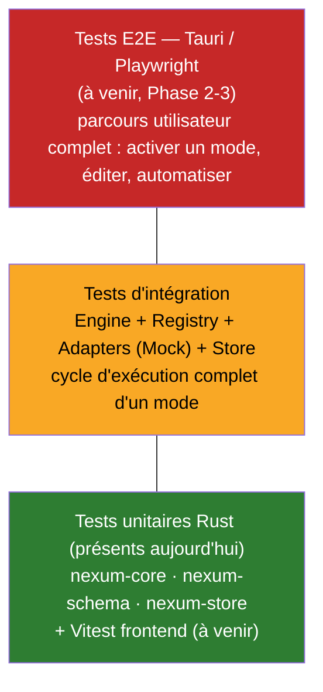
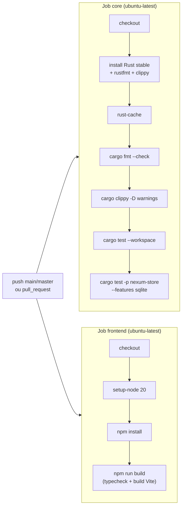
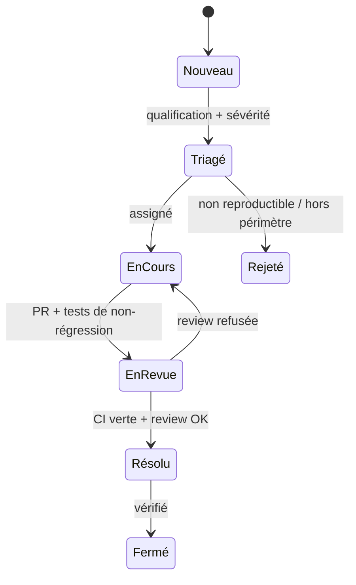

# Stratégie d'assurance qualité & de tests — Nexum

> **RNCP — Bloc 5 : Assurer la qualité d'un projet de développement.**
> Document jury-ready. Source de vérité factuelle : `docs/eip/_BRIEF_PROJET.md`,
> `NEXUM_PLAN_TECHNIQUE_ET_ROADMAP.md`, `README.md`, `.github/workflows/ci.yml`.
> Dernière mise à jour : 2026-07-13. Cible : démo live vérifiée pour le Greenlight Jury de **juillet 2027**.

---

## 1. Politique qualité

### 1.1 Objectif

Garantir que Nexum est **fiable, sûr et démontrable en live** (aucune vidéo autorisée au jury de
juillet 2027). Une action mal exécutée devant le jury — un mode qui échoue, un volume qui ne change
pas, une lampe Hue qui ne s'allume pas — est un échec produit. La qualité n'est donc pas une option
mais une contrainte de démonstrabilité.

### 1.2 Principes directeurs (hérités de l'architecture)

L'architecture de Nexum a été conçue pour être testable ; la stratégie QA en tire directement parti :

| Principe d'architecture | Conséquence qualité |
|---|---|
| **Core OS-agnostique** (`nexum-core`) | La logique métier (Engine, Registry, Bus, règles, scoring) se teste **en CI sans matériel ni OS spécifique**. C'est le socle de couverture. |
| **Un Mode = données, jamais du code** | Pas de code arbitraire à tester ; on valide des `action_type` contre une **allowlist** et des `params` typés. Surface d'attaque et surface de test réduites. |
| **Schéma unique** (`nexum-schema`) | Le DSL est la source de vérité générée en TS et Rust → on élimine par conception la classe de bugs « désync front/back » du prototype. |
| **Adapters isolés derrière un trait** | Le code spécifique OS/marque est confiné ; il se **mocke** via l'implémentation `Mock` pour tester l'Engine sans dépendances réelles. |
| **`on_error` par step (`continue`/`abort`)** | La dégradation est un comportement **spécifié et testable**, pas un accident. |

### 1.3 Exigences qualité (non fonctionnelles)

- **Fiabilité :** un mode qui échoue partiellement doit respecter sa politique `on_error` et
  journaliser chaque step (table `MODE_EXECUTIONS`).
- **Sécurité :** aucun mode partagé ne doit pouvoir contenir un `action_type` hors allowlist
  (garanti par l'analyse statique de la Marketplace, testée).
- **Performance :** cœur Rust event-driven, pas de polling — empreinte CPU/RAM minimale (axe 3 du
  radar produit). *Hypothèse : des tests de performance formels (budgets latence/mémoire) seront
  ajoutés en Phase 3, non prioritaires avant le MVP.*
- **Portabilité :** parité de comportement Windows/Linux sur les actions V1, vérifiée par CI
  multi-OS (cf. §6.4, évolution planifiée).

---

## 2. Pyramide de tests



**Lecture :** base large de tests unitaires rapides et déterministes (déjà en place et exécutés en
CI), une couche d'intégration au niveau du moteur, et un sommet e2e mince mais critique pour valider
les parcours de démo. On investit massivement dans la base (verte) car c'est là que réside la valeur
métier, et là que le core OS-agnostique rend le test gratuit et fiable.

### 2.1 Niveau unitaire (présent)

Tests `#[test]` / `#[tokio::test]` colocalisés dans les crates. Exécutés par `cargo test --workspace`
dans la CI actuelle (`.github/workflows/ci.yml`, job `core`).

- **`nexum-schema`** — validation du DSL : (dé)sérialisation des `Mode`/`ActionStep`, `action_type`
  namespacés, valeurs de `params` typées, valeurs d'`on_error`, robustesse du parsing (JSON
  malformé, champ inconnu, ordre des steps).
- **`nexum-core`** — cœur de la valeur métier :
  - Action Registry : résolution `action_type → handler`, rejet d'un type inconnu.
  - Engine : ordre d'exécution des steps, application de `on_error` (`continue` vs `abort`),
    émission des événements de succès/échec sur l'Event Bus.
  - Automation Engine : évaluation des règles SI/ALORS (ex. `time >= 18:00 → Mode Chill`),
    conditions, résolution des conflits de modes (`last-write + priorité`).
  - Marketplace safety : analyse statique contre l'allowlist + **score de risque** (ex.
    `system.close_app` sur process sensible = risque plus élevé).
  - Capability Checker : steps incompatibles ignorés/signalés selon disponibilité.
- **`nexum-store`** — persistance : contrat `ModeStore` (implémentation in-memory **et** SQLite
  derrière la feature `sqlite`), CRUD de modes, file d'attente de sync. La CI exécute un job dédié
  `cargo test -p nexum-store --features sqlite`.

### 2.2 Niveau intégration (partiel → à étoffer)

Vérifie la **collaboration** des composants du core sur un scénario réaliste, en branchant l'Engine
sur des Adapters `Mock` (déjà fournis) et un `ModeStore` in-memory :

1. Charger une définition de Mode (JSON) → 2. Capability check → 3. exécuter chaque step via le
Registry → 4. appliquer `on_error` → 5. journaliser dans le Store → 6. pousser en file de sync.

C'est le test qui reproduit le **cycle d'exécution** décrit §4.2 du plan technique. Il donne la
confiance que « activer un mode » fonctionne de bout en bout côté logique, indépendamment du matériel.
*Hypothèse : ces tests d'intégration existent partiellement (safety + automation testés d'après le
README) et seront complétés en Phase 1 pour couvrir le parcours d'exécution complet.*

### 2.3 Niveau end-to-end (à venir — Phase 2/3)

Parcours utilisateur réels dans l'application Tauri + React (4 onglets : Dashboard, Éditeur de modes,
Automations, Marketplace) :

- **Frontend isolé :** composants React et logique d'éditeur testés avec **Vitest** (+ Testing
  Library) — rapide, sans backend.
- **Application intégrée :** **Playwright** (ou WebDriver via `tauri-driver`) pilote l'app packagée
  pour valider les scénarios BTP : créer un mode no-code, l'activer et voir le feed d'événements live,
  simuler l'horloge pour l'automatisation « Chill à 18:00 », évaluer un mode dans la Marketplace.

Ces tests protègent directement les **9 features démontrables du BTP** et donc la démo live.

---

## 3. Matrice de couverture par crate

| Crate / module | Rôle | Type de test | Statut | Objectif de couverture |
|---|---|---|---|---|
| `nexum-schema` | DSL Mode/Action (source de vérité) | Unitaire | ✅ présent | **> 85 %** (surface petite et critique) |
| `nexum-core` — Engine | Orchestration, ordre, `on_error`, events | Unitaire + intégration | ✅ présent | **> 80 %** |
| `nexum-core` — Registry | `action_type → handler` | Unitaire | ✅ présent | > 85 % |
| `nexum-core` — Automation | Règles SI/ALORS, conflits | Unitaire | ✅ présent | > 80 % |
| `nexum-core` — Marketplace safety | Allowlist + score de risque | Unitaire | ✅ présent | **> 90 %** (sécurité) |
| `nexum-core` — Capability Checker | Disponibilité HW/API | Unitaire | 🔸 partiel | > 75 % |
| `nexum-store` | `ModeStore` in-memory + SQLite | Unitaire (feature `sqlite`) | ✅ présent | **> 80 %** |
| `nexum-adapters` | System/Gaming (réels), Audio, Display/Hue/RGB | Unitaire (validation) + Mock | 🔸 partiel | > 60 % (code OS testé en partie via mocks/CI multi-OS) |
| `services/nexum-cloud` | API axum (sync, marketplace, IA) | Intégration HTTP | ⛔ à venir | > 70 % |
| `apps/desktop` (frontend) | React/TS, éditeur no-code | Vitest | ⛔ à venir | > 70 % lignes |
| `apps/desktop` (app) | Parcours Tauri complets | Playwright/e2e | ⛔ à venir | Scénarios BTP couverts à 100 % |

Légende : ✅ en place · 🔸 partiel · ⛔ planifié. Statuts alignés sur le README (état réel du scaffold).

### 3.1 Objectifs de couverture — justification

- **> 80 % de couverture de lignes sur `nexum-core`** est l'objectif phare : c'est là qu'est la
  valeur métier, et le code y est **100 % testable sans OS/matériel**. Cet objectif est atteignable
  et défendable devant le jury (argument direct du Bloc 5).
- Les **modules de sécurité** (Marketplace safety) visent **> 90 %** car un défaut y a un impact
  sécurité direct (mode malveillant publié).
- Les **Adapters** ont une cible plus basse (> 60 %) car ils contiennent du code `#[cfg(target_os)]`
  qui nécessite du matériel réel ; on teste la partie `validate()` et la logique via `Mock`, le reste
  est couvert par la CI multi-OS et les tests e2e.
- **Hypothèse :** les cibles chiffrées sont des objectifs d'équipe, non encore mesurés en CI ;
  l'instrumentation de couverture (cf. §4) sera branchée en Phase 1 pour rendre ces chiffres réels et
  suivis dans le temps.

---

## 4. Outils qualité

| Domaine | Outil | Usage | Statut |
|---|---|---|---|
| Tests unitaires/intégration Rust | **`cargo test`** (`--workspace`, `+ --features sqlite`) | Exécution de tous les tests | ✅ en CI |
| Lint Rust | **`cargo clippy --workspace --all-targets -- -D warnings`** | **Zéro warning toléré** (build cassé si warning) | ✅ en CI |
| Formatage Rust | **`cargo fmt --all -- --check`** | Style uniforme imposé | ✅ en CI |
| Couverture Rust | **`cargo-llvm-cov`** (ou `cargo-tarpaulin`) | Mesure % de couverture, export lcov/HTML | ⛔ à brancher (Phase 1) |
| Typecheck frontend | **`tsc` / `npm run build`** (Vite) | Compilation TS sans erreur | ✅ en CI |
| Tests unitaires frontend | **Vitest** (+ Testing Library) | Composants React, logique éditeur | ⛔ à venir |
| Tests e2e | **Playwright** (+ `tauri-driver`) | Parcours BTP complets | ⛔ à venir |
| Audit dépendances | **`cargo audit`** / `npm audit` | Vulnérabilités connues (RustSec) | ⛔ recommandé (Phase 2) |

> **Note de rigueur :** le choix `clippy -D warnings` transforme chaque avertissement en erreur
> bloquante. C'est une politique volontairement stricte qui force la propreté du code à chaque PR —
> argument fort de maturité qualité pour le jury.

Commandes locales (identiques à la CI, cf. README) :

```bash
cd nexum
cargo fmt --all -- --check
cargo clippy --workspace --all-targets -- -D warnings
cargo test --workspace
cargo test -p nexum-store --features sqlite
# couverture (à venir) :
cargo llvm-cov --workspace --lcov --output-path lcov.info
```

---

## 5. Intégration continue (pipeline existant)

Le fichier `.github/workflows/ci.yml` est déjà opérationnel. Il se déclenche sur **push** vers
`main`/`master` et sur **chaque pull request**. Deux jobs parallèles :



**Ce que la CI garantit aujourd'hui à chaque PR :**
1. Le code Rust est **formaté** (`fmt --check`).
2. Le code Rust passe le lint **sans aucun warning** (`clippy -D warnings`).
3. **Tous les tests** du workspace passent, **y compris** le chemin SQLite (feature `sqlite`).
4. Le frontend **compile et typecheck** (`npm run build`).
5. Le cache Rust (`Swatinem/rust-cache@v2`) accélère les runs.

**Évolutions planifiées de la CI (Bloc 6 associé) :**
- **Job couverture** exécutant `cargo llvm-cov` + publication du rapport (badge/PR comment), avec un
  **seuil minimal** faisant échouer la CI sous l'objectif (ex. `nexum-core` < 80 %).
- **Matrice multi-OS** (`ubuntu-latest`, `windows-latest`) pour valider la parité des Adapters
  System/Audio/Display sur Windows (OS prioritaire) et Linux.
- **Jobs Vitest + Playwright** une fois le frontend et l'app stabilisés.
- **`cargo audit` / `npm audit`** en job non bloquant puis bloquant.

---

## 6. Gestion des bugs

### 6.1 Workflow

Traçabilité via **GitHub Issues** (label `bug`) + tableau de projet. Cycle de vie :



**Règle de non-régression :** tout bug corrigé doit être accompagné d'un **test qui échouait avant le
fix** et passe après. C'est ce qui fait croître la couverture de façon utile.

### 6.2 Grille de sévérité

| Sévérité | Définition | Exemple Nexum | Délai cible |
|---|---|---|---|
| **S1 — Bloquant** | Empêche une feature de démo BTP ou crash | Mode qui ne s'active pas ; volume Windows KO devant le jury | Immédiat (avant tout autre travail) |
| **S2 — Majeur** | Fonction dégradée sans contournement simple | Sync cloud qui perd un mode ; Hue qui clignote | ≤ 3 jours |
| **S3 — Mineur** | Défaut avec contournement / cosmétique fonctionnel | Ordre d'affichage des steps, message d'erreur peu clair | Prochain sprint |
| **S4 — Trivial** | Cosmétique pur | Typo UI, alignement | Best-effort |

> Le **bug volume Windows** hérité du prototype (stub PowerShell non fonctionnel) est classé **S1** et
> priorisé dès la Phase 0 (Core Audio via crate `windows`), Windows étant l'OS prioritaire.

---

## 7. Definition of Done (DoD)

Une tâche / une PR n'est **« Done »** que si **toutes** les conditions sont remplies :

- [ ] Le code compile (`cargo build` + `npm run build`).
- [ ] `cargo fmt --check` passe (formatage).
- [ ] `cargo clippy -D warnings` passe (**zéro warning**).
- [ ] `cargo test --workspace` + chemin `sqlite` passent (vert en CI).
- [ ] La feature est couverte par des **tests** (unitaire au minimum ; intégration/e2e si parcours
      utilisateur) ; un bug corrigé a son test de non-régression.
- [ ] La **couverture** de la crate touchée ne régresse pas (objectif `nexum-core` > 80 %).
- [ ] Si le DSL change : `nexum-schema` mis à jour **et** types TS régénérés (pas de désync).
- [ ] Aucun `action_type` ajouté sans entrée dans l'**allowlist** + `validate()` d'Adapter.
- [ ] **Revue de code** approuvée par au moins un pair (cf. §8).
- [ ] Documentation / changelog mis à jour si comportement visible modifié.
- [ ] Pour une feature BTP : **démontrable manuellement** dans l'app.

---

## 8. Revue de code

- **Pull Request obligatoire** : aucun merge direct sur `main`/`master`. Branche par
  feature/fix → PR → review → merge.
- **CI bloquante** : la PR ne peut être mergée que si les jobs `core` et `frontend` sont verts
  (statut requis sur la branche protégée).
- **Au moins un relecteur** par PR (équipe EIP restreinte). Le relecteur vérifie :
  correction fonctionnelle, présence et pertinence des tests, respect de l'architecture (Core
  OS-agnostique, pas de dépendance marque dans le cœur, action typée + allowlist), lisibilité,
  absence de dette non documentée.
- **Checklist de PR** = la Definition of Done ci-dessus (§7), matérialisée dans un template de PR.
- **Petites PR** privilégiées (revue efficace, moins de risque de régression).

---

## 9. Synthèse pour le jury (Bloc 5)

Nexum démontre une démarche qualité **réelle et déjà outillée**, pas seulement déclarative :
- une CI qui **bloque** sur format, lint zéro-warning, tests et typecheck **dès aujourd'hui** ;
- une architecture **pensée pour le test** (core OS-agnostique 100 % testable, modes = données) ;
- des tests unitaires **présents** sur les 3 crates de valeur (`core`, `schema`, `store`) ;
- une trajectoire claire vers la couverture mesurée (> 80 % sur le core), les tests e2e Tauri et la
  CI multi-OS, alignée sur le calendrier EIP (MVP → BTP janvier 2027 → démo live juillet 2027).
